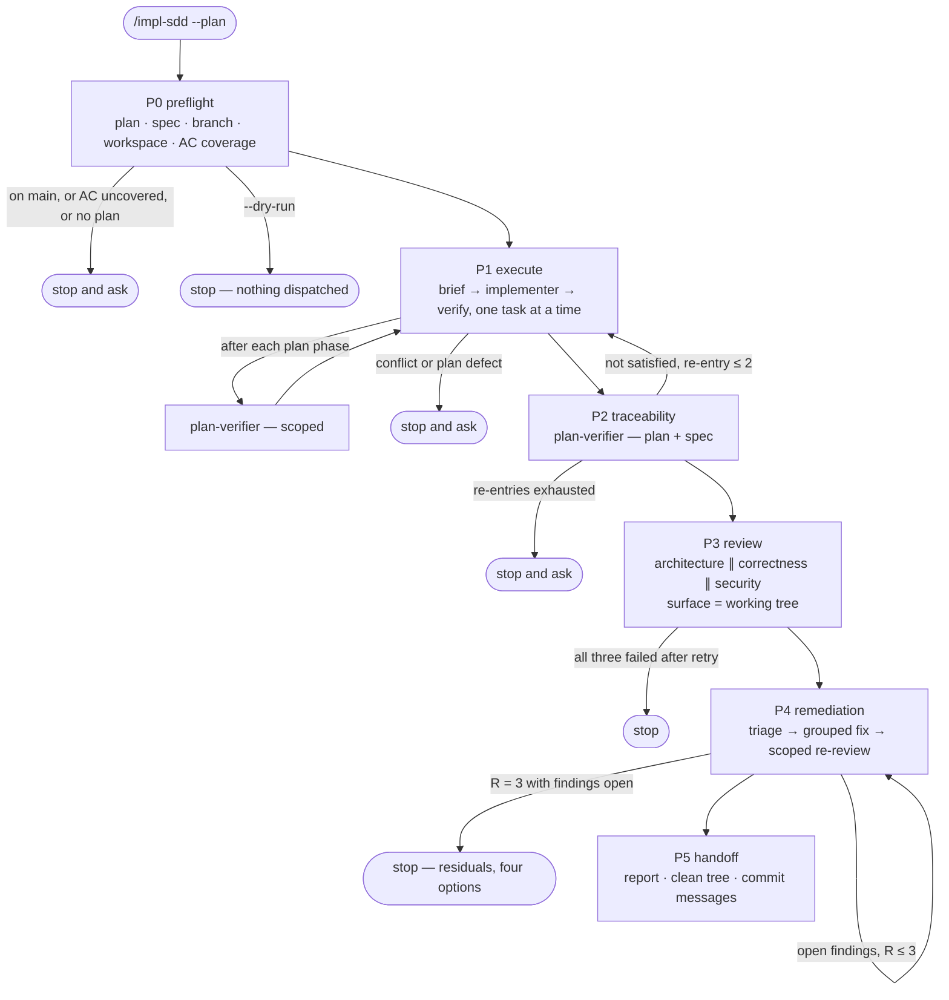

# Phases

Six phases, executed in order. Each section states what the phase reads, what it
dispatches and with what surface, what it appends to the ledger, and what ends
it. The ids are fixed: renaming one breaks the resume protocol in
[ledger.md](ledger.md).



---

## P0 — preflight

**Reads:** the plan; the spec named by `--spec` or by the plan's `Spec:` header.
**Dispatches:** nothing. Every check here is yours, done by reading the two files.

1. **Resolve the plan and the spec.** If neither a plan path nor a resolvable one
   exists, stop and ask — before anything is dispatched.
2. **Check the branch.** `git rev-parse --abbrev-ref HEAD`. On `main`, stop and
   ask. Do **not** create, switch or delete a branch to fix it; that is the
   human's call and this command has no branch grant.
3. **Record the tree state.** A dirty working tree is written into the P0 ledger
   line and does **not** stop the run — the same rule
   [`pr-self-review`](../pr-self-review/SKILL.md) uses. What matters is that the
   report says so.
4. **Open the workspace.** `node scripts/impl-sdd-workspace.mjs <plan-path>`
   prints the run's paths as JSON. It creates `briefs/` and `reports/` and opens
   the ledger without truncating an existing one, so a resumed run keeps its
   history.
5. **List the AC coverage.** Every `AC-N` in the spec must be claimed by some
   task's `Satisfies:` line or named in the plan's `## Out of scope`. Print the
   uncovered ids and **do not enter P1 while that list is non-empty** — a plan
   that silently drops a requirement is exactly what this gate exists for. With
   no spec, write `no spec — coverage not checked` and carry it into the report.
6. **`--dry-run` stops here**, having dispatched nothing.

**Ends when:** the coverage list is empty and the branch is not `main`.

## P1 — execute

**Reads:** the plan's tasks, in order.
**Dispatches:** [`implementer`](../../agents/implementer.md), one at a time.

For each task:

1. **Write the brief first** — the five parts in [briefs.md](briefs.md). The
   brief is the subagent's context; it should not need to go looking.
2. **Dispatch one implementer.** Never two at once: five packages share one
   Postgres container, one clone directory and five `node_modules`, and parallel
   typechecks race.
3. **Verify at task level** — the touched package's typecheck plus the test files
   the task names, with `--reporter=dot --bail=1`. The full lane is a phase-level
   gate, not a per-task one.
4. **Verify at plan-phase level** — when a phase of the plan completes, run that
   package's full test lane plus `cd server && pnpm arch:check` if `server/` was
   touched, then dispatch [`plan-verifier`](../../agents/plan-verifier.md) scoped
   to that phase's tasks and their `Interfaces: Produces` names. A renamed export
   breaks the next task, and catching it one task later is far cheaper than three.
5. **Append `task-start` and `task-done`.** A task with a failed verification gets
   no `task-done` line, and at most 30 lines of its output go into the ledger.

**Stop and ask** when an implementer reports a conflict between the plan and the
spec, or a plan defect — a placeholder, a missing `Files:` line, an `Interfaces:`
name no task defines. Do not improvise a resolution: the spec wins, and acting on
that rule is the human's, not yours.

**Ends when:** every task has a `task-done` line.

## P2 — traceability

**Dispatches:** [`plan-verifier`](../../agents/plan-verifier.md), once, with
**both** the plan and the spec as item sources.

Its report gives you three things: a row per item with evidence, the
`Could not verify` table, and the `AC coverage:` line. Items it marks
`not verifiable` because they need a command it may not run — the DB-backed
lane, the e2e stack — are carried into the P5 report with that exact command, not
quietly treated as satisfied.

While any `not satisfied` item remains, return to P1 **for the owning tasks
only**, at most twice. Then stop and ask: three failures to satisfy the same item
is a plan or spec problem, not an implementation one.

**Ends when:** no `not satisfied` item remains.

## P3 — review

**Dispatches, concurrently:**

| Axis | Who | Judges |
|---|---|---|
| architecture | [`architecture-reviewer`](../../agents/architecture-reviewer.md) | boundaries B1–B6 only |
| correctness | `/code-review` | bugs, reuse, simplification |
| security | `/security-review` | there is no security-reviewer agent yet, and its absence is stated in the report |

Every dispatch carries the review-surface note from [briefs.md](briefs.md)
verbatim. This is the one place a naive run fails silently: **this command commits
nothing, so `git diff main...HEAD` is empty** and a reviewer handed that range
reports a pass on nothing. The surface is the working tree — `git status
--porcelain`, `git diff`, and the untracked paths from the plan's
`## File Structure`.

Collect everything into `findings.md`. A reviewer that fails, times out, or
returns unparseable output is handled by the retry rule in
[remediation.md](remediation.md), not here.

**Ends when:** `findings.md` is written.

## P4 — remediation

See [remediation.md](remediation.md) in full: the four triage buckets, grouped
dispatch, the scoped re-review, the three-round cap and what happens at the cap.

**Ends when:** no `must-fix` or `fix-in-scope` finding is open, or round three
has ended.

## P5 — handoff

**Dispatches:** nothing. Write the report and stop.

```markdown
Run: <plan path> · spec <path or none>
Outcome: clean | incomplete — <axis> not reviewed

## Shipped
<tasks done, files changed>

## Coverage
<plan-verifier's Coverage: and AC coverage: lines, verbatim>

## Findings
<per bucket: closed, deferred, waived, residual — with ids>

## Not verified
<items needing a command this run may not execute, with that command>

## Your next steps
1. Review the working tree.
2. Commit — the plan's own commit messages, in task order:
   <messages>
3. Run /pr-self-review before opening the PR.
```

The working tree is left as it is. Nothing is committed, staged, or pushed.

**Ends when:** the report is printed. This is where the command stops.
