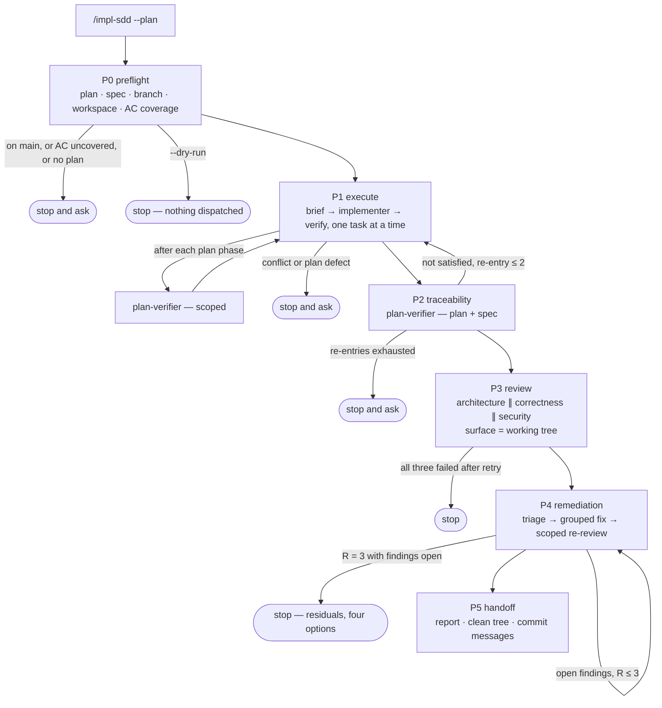

# `/impl-sdd` Implementation Plan

> **For agentic workers:** REQUIRED SUB-SKILL: Use superpowers:executing-plans to implement this plan task-by-task. Steps use checkbox (`- [ ]`) syntax for tracking.

**Goal:** Ship `/impl-sdd` — a command that takes an approved plan, executes it task by task, traces it against its spec, reviews it on three axes, and remediates the findings in bounded rounds — plus the three repository changes the workflow depends on.

**Architecture:** The command is a **playbook, not a program**: a project skill whose body the main session follows, dispatching this repository's existing agents in a fixed order. The one executable artifact is a workspace resolver that owns the run directory's paths. Context reaches cold subagents through brief *files*, and the run's history lives in an append-only ledger, so a compacted session resumes instead of re-dispatching finished work. Nothing in any phase commits.

**Tech Stack:** Claude Code project skills (`.claude/skills/`) and subagents (`.claude/agents/`), `node:test` on Node 24 for the resolver and the documentation invariants, the `superpowers` plugin for `writing-plans` / `executing-plans`.

**Spec:** [`docs/superpowers/specs/SPEC-2026-08-13-impl-sdd.md`](../specs/SPEC-2026-08-13-impl-sdd.md)
**Execution mode:** single-pass — one implementer context runs the plan end to end. Eight tasks, but seven of them are prose in one skill folder, and Tasks 5–7 fix vocabulary (phase ids, ledger grammar, bucket names) that the later ones quote verbatim. The planner's heuristic for multi-agent — four or more tasks *across different packages*, coupled only through `Interfaces:` — does not fire.
**Packages in scope:** repo tooling only — `.claude/`, `scripts/`, root `CLAUDE.md`, `.gitignore`. No application package is touched.
**Skills the implementer will be bound by:** none from the routing table — no file under `server/`, `client/`, `reviewer-core/`, `mcp/` or `e2e/` changes. `mermaid-diagram` for the one diagram in `phases.md`.
**Insights consulted:** root `INSIGHTS.md` — 2026-08-02 (`node --test scripts/` does not discover tests in this repo; use the glob) and 2026-08-05 (hook commands must quote the path inside one string; settings rules are session-global, so prohibitions belong in an agent's body).

---

## Requirements review

| # | Requirement (as given) | Status | Note |
|---|---|---|---|
| AC-1 … AC-24 | The command's behaviour | clear | Tasks 5–7. Every one is a rule in a skill body; the mechanical ones (phase ids, buckets, caps) are asserted by the documentation test introduced in Task 5 |
| AC-25, AC-26 | Workspace paths and path-escape rejection | clear | Task 1 — the only requirements with a conventional test cycle |
| AC-27, AC-30 | `plan-verifier` reads `SPEC-*.md`; runs on `sonnet` | clear | Task 2. P0 and P2 both depend on it, so it lands before the command |
| AC-28 | Superpowers policy in `CLAUDE.md` | clear | Task 4 |
| AC-29 | `mcp/` in the three routing surfaces | clear | Task 3 |
| E1 … E12 | Edge cases | clear | Folded into the phase and remediation rules; E7 (frozen violations) is restated in `remediation.md` because that is where the temptation to "fix" one appears |

Gaps found:

- **Five of the spec's `Verified by` cells say `manual observation`.** That is honest — a skill body has no runtime — but it leaves most of the command unverifiable by command, which this repository treats as a defect. This plan closes part of it: Task 5 introduces `scripts/impl-sdd-docs.test.mjs`, which asserts the *structural* invariants (the six phase ids, the four bucket names, link resolution, the prohibition list) so that the vocabulary the spec fixes cannot silently drift. Prose remains reviewed by a human; structure is now tested.
- **No security-reviewer agent exists.** P3's third axis is the built-in `/security-review`. Out of scope, unchanged from the spec.
- **`mcp/` has no `CLAUDE.md`** (only `INSIGHTS.md`), so Task 3 can wire it into three routing surfaces but cannot cite package-local law that does not exist. Noted as follow-up rather than invented here.

## Recommendations

| # | Recommendation | Why it is better | Cost | Status |
|---|---|---|---|---|
| N1 | Test the documentation's structural invariants rather than trusting prose | The spec fixes a vocabulary — six phase ids, four buckets, three caps — and every one of them is quoted across four files. A rename in one file is exactly the drift a grep-level test catches for free | ~70 lines of `node:test`, one new file | **applied** — Task 5, extended in 6 and 7 |
| N2 | Land Tasks 2–4 before the command | Each is independently useful and independently reviewable; and `plan-verifier` reading `SPEC-*.md` is a hard dependency of the command's own P0 gate | none — it is only ordering | **applied** |
| N3 | Do not use `superpowers:subagent-driven-development` as the executor | It dispatches `general-purpose` subagents with its own implementer prompt, so this repository's implementer, its skill routing and its `arch:check` gate are bypassed; its implementer template also commits per task | we write the loop ourselves | **applied** — recorded in the spec's decisions table |
| N4 | Give `mcp/` a `CLAUDE.md` | Task 3 wires it into three routing surfaces, but a reviewer routed there has no package-local law to cite | its own small change | proposed — follow-up |

---

## Global Constraints

Every task's requirements implicitly include this section.

- **Commits are the caller's.** The implementer stops at a verified, complete task and reports; it never runs `git commit`, `git push`, or `superpowers:finishing-a-development-branch`.
- **No phase of the shipped command may commit, stage, push, create or switch a branch or worktree, flip a spec's `Status:`, run `pnpm arch:baseline`, or run `docker compose down -v`** (AC-24). This is a property of the artifact being written, not only of the writing.
- **The six phase ids are fixed and quoted verbatim everywhere:** `P0 preflight · P1 execute · P2 traceability · P3 review · P4 remediation · P5 handoff`.
- **The four triage buckets are fixed:** `must-fix · fix-in-scope · defer · conflict`.
- **The three caps are fixed:** remediation rounds ≤ 3; P2→P1 re-entries ≤ 2; verification output pasted into the ledger ≤ 30 lines. Reviewer retries: exactly 1.
- **Workspace root:** `.devdigest/impl-sdd/<plan-basename>/`, git-ignored, every path built with `path.join`.
- **Ledger line grammar:** `<ISO8601> · <Pn> · <event> · <subject> · <outcome>`, append-only, never rewritten.
- **`node --test scripts/` does not work in this repository** — there is no root `package.json`, so Node treats the directory as an entry module and dies. The command is `node --test "scripts/*.test.mjs"`.
- **CLI entrypoints compare against `pathToFileURL(process.argv[1]).href`**, never the `file://${process.argv[1]}` template, which silently exits 0 on Windows. Reference: [`server/src/db/migrate.ts`](../../../server/src/db/migrate.ts).
- **Portability:** `path.join` / `path.resolve`, no hardcoded separator, no platform branch. CI is Linux; the author is on Windows.
- **Five packages, two package managers:** `server/`, `client/`, `mcp/` are pnpm; `reviewer-core/`, `e2e/` are npm.
- **Gates before "done":** `node --test "scripts/*.test.mjs"` passes · every relative link in `.claude/skills/impl-sdd/*.md` resolves · `git status` shows no commit was made.

---

## File Structure

**Created**

| File | Responsibility |
|---|---|
| `scripts/impl-sdd-workspace.mjs` | Resolve and create a run's workspace; reject a plan path that escapes the repository; print the paths as JSON. The only executable artifact. |
| `scripts/impl-sdd-workspace.test.mjs` | `node:test` coverage for path resolution, idempotency and the slug rules. |
| `scripts/impl-sdd-docs.test.mjs` | `node:test` coverage for the skill's structural invariants — phase ids, bucket names, link resolution, the prohibition list. |
| `.claude/skills/impl-sdd/SKILL.md` | The command: arguments, the phase spine, the two stopping rules, the prohibitions. Lean; detail lives in the three companions. |
| `.claude/skills/impl-sdd/phases.md` | P0–P5 in full — what each dispatches, with what surface, and what ends it. One Mermaid diagram. |
| `.claude/skills/impl-sdd/briefs.md` | The three templates: task brief, remediation brief, review-surface note. |
| `.claude/skills/impl-sdd/remediation.md` | P4: the four buckets, the round protocol, the reviewer-failure rule, the R=3 escalation. |
| `.claude/skills/impl-sdd/ledger.md` | Ledger grammar, the event vocabulary, and the resume protocol. |

**Modified**

| File | Change |
|---|---|
| `.claude/agents/plan-verifier.md` | `model: sonnet`; `SPEC-*.md` as an item source; the `Satisfies:` cross-check; an `AC coverage:` output line. |
| `.claude/agents/implementer.md` | `mcp/` row in the commands table; the package-manager sentence corrected to five packages. |
| `.claude/skills/pr-self-review/routing.md` | `mcp/src/**` glob row and an `mcp/**` row in the deterministic command matrix. |
| `.claude/agents/architecture-reviewer.md` | `mcp/` named — either as a boundary or explicitly as not reviewed, so its verdict table is never silent about it. |
| `CLAUDE.md` | A `## Superpowers` section: which plugin skills this workflow uses, and which it excludes, each with the behaviour that excludes it. |
| `.gitignore` | `.devdigest/impl-sdd/`. |
| `.claude/skills/README.md` | Catalog row for `impl-sdd`. |
| `.claude/agents/README.md` | An `## Orchestration` note naming `/impl-sdd` as the entry point. |

---

## Task 1: Workspace resolver

**Files:**
- Create: `scripts/impl-sdd-workspace.mjs`
- Test: `scripts/impl-sdd-workspace.test.mjs`

**Interfaces:**
- Consumes: nothing.
- Produces:
  - `slugFor(planPath: string): string` — the plan's basename without `.md`; throws `TypeError` when the path is absolute or contains `..`.
  - `resolveWorkspace(planPath: string, opts?: { cwd?: string, create?: boolean }): { root: string, ledger: string, briefs: string, reports: string, findings: string }` — absolute paths; `create` defaults to `true` in the CLI and must be passed `false` by tests.
  - CLI: `node scripts/impl-sdd-workspace.mjs <plan-path>` prints that object as JSON on stdout.

**Skills:** none — plain Node, no application package touched.
**Verify:** `node --test "scripts/*.test.mjs"`
**Satisfies:** AC-25, AC-26

- [ ] **Step 1: Write the failing test**

Create `scripts/impl-sdd-workspace.test.mjs`:

```js
import { test } from 'node:test';
import assert from 'node:assert/strict';
import path from 'node:path';
import { resolveWorkspace, slugFor } from './impl-sdd-workspace.mjs';

const CWD = path.resolve('/repo');
const PLAN = 'docs/superpowers/plans/2026-08-13-impl-sdd.md';

test('slug is the plan basename without extension', () => {
  assert.equal(slugFor(PLAN), '2026-08-13-impl-sdd');
});

test('slug rejects a traversing path', () => {
  assert.throws(() => slugFor('../../etc/passwd'), TypeError);
});

test('slug rejects an absolute path', () => {
  assert.throws(() => slugFor(path.resolve('/etc/passwd')), TypeError);
});

test('workspace roots under .devdigest/impl-sdd/<slug>', () => {
  const ws = resolveWorkspace(PLAN, { cwd: CWD, create: false });
  assert.equal(ws.root, path.join(CWD, '.devdigest', 'impl-sdd', '2026-08-13-impl-sdd'));
  assert.equal(ws.ledger, path.join(ws.root, 'ledger.md'));
  assert.equal(ws.briefs, path.join(ws.root, 'briefs'));
  assert.equal(ws.reports, path.join(ws.root, 'reports'));
  assert.equal(ws.findings, path.join(ws.root, 'findings.md'));
});

test('paths are joined, never concatenated', () => {
  const ws = resolveWorkspace(PLAN, { cwd: CWD, create: false });
  assert.equal(ws.root.includes('//'), false);
  assert.equal(ws.root.includes('\\\\'), false);
});

test('resolveWorkspace does not touch the filesystem when create is false', () => {
  const ws = resolveWorkspace(PLAN, { cwd: path.resolve('/definitely/missing'), create: false });
  assert.equal(typeof ws.root, 'string');
});
```

- [ ] **Step 2: Run test to verify it fails**

Run: `node --test "scripts/*.test.mjs"`
Expected: FAIL — `Cannot find module` for `./impl-sdd-workspace.mjs`.

- [ ] **Step 3: Write minimal implementation**

Create `scripts/impl-sdd-workspace.mjs`:

```js
#!/usr/bin/env node
/**
 * Workspace resolver for the /impl-sdd command.
 *
 * Every artifact of one run — ledger, briefs, reports, findings — lives under
 * .devdigest/impl-sdd/<plan-basename>/. One plan owns one directory; another
 * plan's directory is never read or written by this run.
 *
 * The plan path arrives from a command argument and names a directory this
 * script creates, so it is validated before use: no absolute paths, no `..`.
 */
import { mkdirSync, existsSync, appendFileSync } from 'node:fs';
import path from 'node:path';
import { pathToFileURL } from 'node:url';

export function slugFor(planPath) {
  if (typeof planPath !== 'string' || planPath.length === 0) {
    throw new TypeError('plan path must be a non-empty repo-relative string');
  }
  if (path.isAbsolute(planPath) || planPath.split(/[\\/]/).includes('..')) {
    throw new TypeError(`plan path must be repo-relative and must not traverse: ${planPath}`);
  }
  return path.basename(planPath, '.md');
}

export function resolveWorkspace(planPath, opts = {}) {
  const cwd = opts.cwd ?? process.cwd();
  const create = opts.create ?? true;
  const root = path.join(cwd, '.devdigest', 'impl-sdd', slugFor(planPath));
  const ws = {
    root,
    ledger: path.join(root, 'ledger.md'),
    briefs: path.join(root, 'briefs'),
    reports: path.join(root, 'reports'),
    findings: path.join(root, 'findings.md'),
  };
  if (create) {
    mkdirSync(ws.briefs, { recursive: true });
    mkdirSync(ws.reports, { recursive: true });
    // Never truncate: a resumed run appends to the ledger it already has.
    if (!existsSync(ws.ledger)) appendFileSync(ws.ledger, `# Ledger — ${slugFor(planPath)}\n\n`);
  }
  return ws;
}

if (import.meta.url === pathToFileURL(process.argv[1]).href) {
  const planPath = process.argv[2];
  if (!planPath) {
    console.error('usage: node scripts/impl-sdd-workspace.mjs <plan-path>');
    process.exit(1);
  }
  console.log(JSON.stringify(resolveWorkspace(planPath), null, 2));
}
```

- [ ] **Step 4: Run test to verify it passes**

Run: `node --test "scripts/*.test.mjs"`
Expected: PASS — the six new tests plus the existing `pr-self-review-gate` tests.

- [ ] **Step 5: Commit**

```bash
git add scripts/impl-sdd-workspace.mjs scripts/impl-sdd-workspace.test.mjs
git commit -m "feat(impl-sdd): workspace resolver for a run directory"
```

*The caller executes this step. The implementer records the message and moves on.*

---

## Task 2: `plan-verifier` reads the spec format

**Files:**
- Modify: `.claude/agents/plan-verifier.md` — frontmatter (lines 1–5), `## Building the item list` (lines 61–74), `## Output contract` (lines 147–184)

**Interfaces:**
- Consumes: the `AC-N` id scheme and `Verified by` column from [`specreator.md`](../../../.claude/agents/specreator.md); the `Satisfies:` task line from [`implementation-planner.md`](../../../.claude/agents/implementation-planner.md).
- Produces: an `AC coverage: <n> of <n> … unclaimed: <ids or none>` line in the verifier's report, which the command's P0 and P2 both read.

**Skills:** none.
**Verify:** `grep -n "model: sonnet" .claude/agents/plan-verifier.md` and `grep -n "SPEC-YYYY-MM-DD\|Satisfies:\|AC coverage" .claude/agents/plan-verifier.md` — the first returns line 5 or nearby, the second returns at least three hits.
**Satisfies:** AC-27, AC-30

- [ ] **Step 1: Pin the model**

Add `model: sonnet` to the frontmatter, after `tools:`. Then add one line to the agent body under the opening paragraphs, so a later session does not "upgrade" it back:

> You run on `sonnet` deliberately: this is mechanical item-to-artifact matching against a closed status vocabulary, and the judgement it needs is bounded by the item's own words.

- [ ] **Step 2: Add the cross-cutting spec as an item source**

In the `## Building the item list` table, add a row above the `<pkg>/specs/*.md` row:

```markdown
| A cross-cutting spec (`docs/superpowers/specs/SPEC-*.md`) | Every `AC-N` row of `## Acceptance criteria (EARS)` (ID `AC-n`), plus every `## Edge cases` row that names an `AC`. The row's `Verified by` cell names the lane that could falsify it — a row whose lane is `*.it.test.ts` or `e2e flow` is `not verifiable` under your command rules, so name the exact command in `## Could not verify` rather than guessing |
```

- [ ] **Step 3: Add the `Satisfies:` cross-check**

Under that table, add:

```markdown
**`Satisfies:` closes the loop in both directions.** Every `AC-N` a plan task
claims must exist in the spec; every `AC-N` in the spec must be claimed by some
task's `Satisfies:` line or named in the plan's `## Out of scope`. An unclaimed
`AC-N` is a `## Plan defects` entry — a plan that silently drops a requirement
is the failure this check exists for. A row marked `withdrawn — superseded by
AC-M` is not an item: skip it, and say so once, the way a `Step N: Commit` step
is handled.
```

- [ ] **Step 4: Add the output line**

In the `## Output contract` fenced block, directly below the `Coverage:` line:

```markdown
AC coverage: <n> of <n> spec acceptance criteria claimed by a task; unclaimed: <ids or none>
```

And below the fence, extend the existing sentence about the `Coverage:` line adding up:

> `AC coverage:` is reported whenever a spec was among the item sources, and reads `n/a — no spec cited` when none was.

- [ ] **Step 5: Verify**

Run: `grep -n "model: sonnet" .claude/agents/plan-verifier.md && grep -c "AC coverage" .claude/agents/plan-verifier.md`
Expected: the frontmatter hit, and a count of at least 2. Then re-read the file and confirm the four statuses, the "no code review" rule and the read-only Bash discipline are untouched.

- [ ] **Step 6: Commit**

```bash
git add .claude/agents/plan-verifier.md
git commit -m "feat(agents): plan-verifier traces spec AC-N ids and runs on sonnet"
```

*The caller executes this step.*

---

## Task 3: Close the `mcp/` routing holes

**Files:**
- Modify: `.claude/agents/implementer.md` — the sentence and table at lines 164–173
- Modify: `.claude/skills/pr-self-review/routing.md` — the glob table and the Phase 1 command matrix
- Modify: `.claude/agents/architecture-reviewer.md` — the boundary list and the verdict table

**Interfaces:**
- Consumes: nothing.
- Produces: nothing later tasks depend on.

**Skills:** none.
**Verify:** `grep -l "mcp/" .claude/agents/implementer.md .claude/skills/pr-self-review/routing.md .claude/agents/architecture-reviewer.md` returns all three paths.
**Satisfies:** AC-29

- [ ] **Step 1: Fix the implementer's package sentence and table**

Replace the sentence above the commands table:

> Never guess a command or a package manager. `server/`, `client/` and `mcp/` are **pnpm**; `reviewer-core/` and `e2e/` are **npm**. Using the wrong one writes a second lockfile — that is a defect, not a nuisance.

Then add this row to the table, after `e2e/`:

```markdown
| `mcp/` | `pnpm install` | `cd mcp && pnpm typecheck` | `cd mcp && pnpm test` | `build` is `tsc --noEmit`; it has its own `pnpm-workspace.yaml` |
```

- [ ] **Step 2: Route `mcp/` in `pr-self-review`**

Add to the glob table in `routing.md`:

```markdown
| `mcp/src/**` | typescript-expert · zod |
```

and to the Phase 1 deterministic matrix:

```markdown
| `mcp/**` | `cd mcp && pnpm typecheck` · `pnpm test` |
```

- [ ] **Step 3: Name `mcp/` in the architecture reviewer**

`mcp/` has no `CLAUDE.md`, so there is no package-local law to cite and inventing one is out of scope. Make the silence explicit instead.

`mcp/tsconfig.json` declares **no `compilerOptions.paths` at all** — verified, not assumed — so add this row to **B5**'s alias table, in the same shape `e2e/` already uses:

```markdown
| `mcp/` | none — standalone; runtime deps are `@modelcontextprotocol/sdk` and its own `zod` |
```

and one line beneath that table:

> Because `mcp/` declares no aliases, **any** import from it into `server/`, `client/` or `reviewer-core/` is a finding — there is no sanctioned path for one. It also installs its own `zod`, so the cross-package `instanceof` rule applies to it exactly as it does to the other packages.

Then one line under **B6**:

> `mcp/` has no package `CLAUDE.md` of its own. Its cross-package imports are in scope under B5; anything else about it is `not reviewed`, and the verdict table says so rather than passing it silently.

- [ ] **Step 4: Verify**

Run: `grep -n "mcp" .claude/agents/implementer.md .claude/skills/pr-self-review/routing.md .claude/agents/architecture-reviewer.md`
Expected: at least one hit in each file; the implementer's package sentence names five packages.

- [ ] **Step 5: Commit**

```bash
git add .claude/agents/implementer.md .claude/skills/pr-self-review/routing.md .claude/agents/architecture-reviewer.md
git commit -m "fix(agents): route mcp/ in the implementer, pr-self-review and the architecture reviewer"
```

*The caller executes this step.*

---

## Task 4: The superpowers policy

**Files:**
- Modify: `CLAUDE.md` — a new `## Superpowers` section, placed after `## Not a monorepo — five standalone packages` and before `## Insights`

**Interfaces:**
- Consumes: nothing.
- Produces: nothing later tasks depend on.

**Skills:** none.
**Verify:** `grep -n "brainstorming\|subagent-driven-development\|finishing-a-development-branch\|writing-skills" CLAUDE.md` returns four hits.
**Satisfies:** AC-28

- [ ] **Step 1: Write the section**

The plugin is enabled in [`.claude/settings.json`](../../../.claude/settings.json), and `superpowers:using-superpowers` states that user instructions take precedence over skills — which is what makes a written policy sufficient. Add:

```markdown
## Superpowers — what this repo uses, and what it does not

The plugin is enabled. Its own `using-superpowers` skill states that user
instructions take precedence over skills, so this section is the policy.

**Used:** `writing-plans` and `executing-plans` (the plan format and the
execution loop, both already bent to this repo in
[`.claude/agents/implementation-planner.md`](.claude/agents/implementation-planner.md)
and [`.claude/agents/implementer.md`](.claude/agents/implementer.md)),
`test-driven-development`, `systematic-debugging`,
`verification-before-completion`, and `dispatching-parallel-agents` — which
[`pr-self-review`](.claude/skills/pr-self-review/SKILL.md) needs to dispatch its
review lanes.

**Not used, and why:**

- **`brainstorming`** writes `docs/superpowers/specs/YYYY-MM-DD-<topic>-design.md`
  **and commits it**. That folder now takes `SPEC-*.md` from `specreator`, and no
  agent here commits.
- **`subagent-driven-development`** dispatches `general-purpose` subagents with
  its own implementer prompt, so this repo's implementer — skill routing, the
  per-package managers, `arch:check`, the two `vendor/shared` copies — is
  bypassed; its implementer template also commits each task, and its controller
  is told to rule on conflicts rather than stop. `/impl-sdd` is the executor
  here.
- **`finishing-a-development-branch`** merges, pushes and opens PRs. All three
  are the caller's, and `gh pr create` is gated by the `pr-self-review` hook.
- **`writing-skills`** competes with this repo's own skill conventions in
  [`.claude/skills/README.md`](.claude/skills/README.md). Invoke it only when
  deliberately authoring a skill.

No agent in this repository commits, pushes, branches, or creates a worktree.
```

- [ ] **Step 2: Verify**

Run: `grep -c "superpowers" CLAUDE.md`
Expected: at least 8. Confirm by reading that no existing section was displaced.

- [ ] **Step 3: Commit**

```bash
git add CLAUDE.md
git commit -m "docs(claude): state which superpowers skills this repo uses"
```

*The caller executes this step.*

---

## Task 5: The command and the phase spine

**Files:**
- Create: `.claude/skills/impl-sdd/SKILL.md`, `.claude/skills/impl-sdd/phases.md`
- Test: `scripts/impl-sdd-docs.test.mjs`

**Interfaces:**
- Consumes: `resolveWorkspace` from Task 1, invoked as `node scripts/impl-sdd-workspace.mjs <plan-path>`; the `AC coverage:` line from Task 2.
- Produces:
  - the six phase ids `P0` `P1` `P2` `P3` `P4` `P5`;
  - the argument set `--plan`, `--spec`, `--from`, `--mode`, `--dry-run`;
  - the heading `## Review surface` in `briefs.md`, referenced by `phases.md`;
  - `SKILL_DIR = .claude/skills/impl-sdd`, the directory Tasks 6 and 7 add files to.

**Skills:** `mermaid-diagram` — invoke it before drawing the diagram in step 6.
**Verify:** `node --test "scripts/*.test.mjs"`
**Satisfies:** AC-1, AC-2, AC-3, AC-4, AC-5, AC-7, AC-8, AC-9, AC-10, AC-12, AC-13, AC-14, AC-24

- [ ] **Step 1: Write the failing test**

Create `scripts/impl-sdd-docs.test.mjs`. It asserts structure, never prose:

```js
import { test } from 'node:test';
import assert from 'node:assert/strict';
import { readFileSync, existsSync, readdirSync } from 'node:fs';
import path from 'node:path';

const DIR = path.join('.claude', 'skills', 'impl-sdd');
const read = (f) => readFileSync(path.join(DIR, f), 'utf8');

test('the skill folder holds the command and its companions', () => {
  assert.equal(existsSync(path.join(DIR, 'SKILL.md')), true);
  assert.equal(existsSync(path.join(DIR, 'phases.md')), true);
});

test('the six phase ids appear, and no seventh', () => {
  const all = readdirSync(DIR)
    .filter((f) => f.endsWith('.md'))
    .map((f) => read(f))
    .join('\n');
  const ids = [...new Set(all.match(/\bP[0-9]\b/g) ?? [])].sort();
  assert.deepEqual(ids, ['P0', 'P1', 'P2', 'P3', 'P4', 'P5']);
});

test('every argument the spec names is documented', () => {
  const skill = read('SKILL.md');
  for (const arg of ['--plan', '--spec', '--from', '--mode', '--dry-run']) {
    assert.ok(skill.includes(arg), `SKILL.md does not document ${arg}`);
  }
});

test('the prohibitions are stated in the command body', () => {
  const skill = read('SKILL.md');
  for (const verb of ['git commit', 'git push', 'worktree', 'arch:baseline', 'docker compose down -v']) {
    assert.ok(skill.includes(verb), `SKILL.md does not forbid ${verb}`);
  }
});

test('every relative link in the skill resolves', () => {
  for (const file of readdirSync(DIR).filter((f) => f.endsWith('.md'))) {
    const body = read(file);
    for (const [, target] of body.matchAll(/\]\((?!https?:)([^)#]+)(?:#[^)]*)?\)/g)) {
      const resolved = path.resolve(DIR, target);
      assert.ok(existsSync(resolved), `${file} links to a missing path: ${target}`);
    }
  }
});
```

- [ ] **Step 2: Run test to verify it fails**

Run: `node --test "scripts/*.test.mjs"`
Expected: FAIL — `ENOENT` on `.claude/skills/impl-sdd`.

- [ ] **Step 3: Write `SKILL.md` — frontmatter and invocation**

```markdown
---
name: impl-sdd
description: Execute an approved implementation plan end to end — task-by-task implementation, traceability against the plan and its spec, a three-axis review, and bounded remediation of the findings. Takes a plan path; writes no spec and no plan. Stops at a clean working tree and never commits. Use after implementation-planner has produced a plan and a human has approved it.
allowed-tools: Read, Glob, Grep, Bash, Write, Edit, Task
---

# `/impl-sdd`

You execute a plan someone already approved. **The plan is the scope, the spec
is the authority, and the ledger is the record.** You dispatch agents; you do
not write code, and you do not write the spec or the plan.

`/impl-sdd --plan <path> [--spec <path>] [--from <Pn>] [--mode multi|single] [--dry-run]`
```

- [ ] **Step 4: Write the argument table**

```markdown
| Argument | Meaning |
|---|---|
| `--plan <path>` | **Required.** A plan in `docs/superpowers/plans/`. |
| `--spec <path>` | The governing spec. Omitted → read the plan's `Spec:` header. Neither → run without coverage checking, and say so. |
| `--from <Pn>` | Resume at a phase, reading state from the ledger. |
| `--mode multi\|single` | Overrides the plan's own `Execution mode:` header. |
| `--dry-run` | Complete P0 and stop, before any implementer is dispatched. |
```

- [ ] **Step 5: Write the phase spine into `SKILL.md`**

One table, six rows, matching the spec's own:

```markdown
| Phase | What happens | Ends when |
|---|---|---|
| P0 preflight | plan and spec resolved, branch checked, workspace opened, AC coverage listed | the coverage list is empty, or the run stops |
| P1 execute | one brief and one implementer per task; `plan-verifier` after each plan phase | every task has a `task-done` line |
| P2 traceability | `plan-verifier` full pass over plan **and** spec | no `not satisfied` item remains, or the run stops |
| P3 review | architecture, correctness and security reviews, concurrently | `findings.md` is written |
| P4 remediation | bounded fix rounds with scoped re-review | no open `must-fix` / `fix-in-scope` finding, or round 3 ends |
| P5 handoff | the report; the working tree is left for the human | always — this is where the command stops |
```

Then link the three companions: [phases.md](phases.md), [briefs.md](briefs.md), [remediation.md](remediation.md), [ledger.md](ledger.md).

*Note: the link test in step 1 fails until Tasks 6 and 7 create `briefs.md`, `remediation.md` and `ledger.md`. Write the links now anyway and let step 9 below run the two tests that can pass; the link assertion goes green at the end of Task 7. Record this in the report as an expected intermediate failure — it is the only one in this plan.*

- [ ] **Step 6: Write `phases.md`**

One section per phase. Each states: what it reads, what it dispatches, with what surface, what it appends to the ledger, and what ends it. The rules that must appear, each traceable to its `AC-N`:

- **P0** — resolve the plan; resolve the spec from `--spec` or the plan header (AC-1); stop and ask if neither exists (AC-2); `git rev-parse --abbrev-ref HEAD`, and **stop and ask on `main` without creating or switching a branch** (AC-3); run `node scripts/impl-sdd-workspace.mjs <plan>`; **a dirty working tree is recorded in the P0 ledger line and does not stop the run** (E2), the same rule `pr-self-review` uses; read both files directly — **no agent is dispatched for this** — and list every spec `AC-N` neither claimed by a task's `Satisfies:` nor named in `## Out of scope`, refusing to enter P1 while that list is non-empty (AC-4); with `--dry-run`, stop here (AC-5).
- **P1** — one task at a time, never two implementers at once (AC-7); write the brief first (Task 6); dispatch `implementer`; task-level verification is the touched package's typecheck plus the test files the task names, phase-level is the full lane plus `arch:check` when `server/` moved (AC-10); after each plan phase dispatch `plan-verifier` scoped to that phase's tasks and their `Interfaces: Produces` names (AC-8); **an implementer reporting a plan/spec conflict or a plan defect stops the run** (AC-9).
- **P2** — dispatch `plan-verifier` with both the plan and the spec as item sources (AC-12); while any `not satisfied` item remains, return to P1 for the owning tasks only, at most twice, then stop and ask (AC-13).
- **P3** — dispatch the three reviewers concurrently, each carrying the review-surface note from [briefs.md](briefs.md): the working tree — `git status --porcelain`, `git diff`, and the untracked paths from the plan's `## File Structure` — **never `main...HEAD`, which is empty because this command never commits** (AC-14).
- **P4** — see [remediation.md](remediation.md).
- **P5** — the report: what shipped, the coverage numbers, the residual findings with their buckets, the deferred list, and the commit messages the plan specified, for the human to execute. The outcome word is `clean` or `incomplete — <axis> not reviewed`.

- [ ] **Step 7: Draw the diagram**

Invoke `mermaid-diagram` first, then add this to `phases.md`:

````markdown

````

- [ ] **Step 8: Write `## What this never does` into `SKILL.md`**

Verbatim, because the documentation test greps for these strings:

```markdown
- `git commit`, `git add`, `git push`, `git reset`, `git stash`, `git checkout`/`switch`.
- Create, switch or delete a branch or a worktree.
- `gh pr create` — `/pr-self-review` is the gate, and it runs after this command.
- Flip a spec's `Status:`, or edit a spec or a plan body. Ticking a plan checkbox is the implementer's one permitted plan edit, not yours.
- `pnpm arch:baseline`, or regenerating `.dependency-cruiser-known-violations.json`.
- `docker compose down -v`.
- Invoke `superpowers:brainstorming`, `superpowers:subagent-driven-development`, or `superpowers:finishing-a-development-branch`.
```

- [ ] **Step 9: Run the tests**

Run: `node --test "scripts/*.test.mjs"`
Expected: the phase-id, argument and prohibition assertions PASS; the link assertion FAILS on `briefs.md`, `remediation.md` and `ledger.md` until Task 7 completes. Report it as the expected intermediate state; do not weaken the assertion to make it green.

- [ ] **Step 10: Commit**

```bash
git add .claude/skills/impl-sdd/SKILL.md .claude/skills/impl-sdd/phases.md scripts/impl-sdd-docs.test.mjs
git commit -m "feat(impl-sdd): the command and its phase spine"
```

*The caller executes this step.*

---

## Task 6: Briefs and the ledger

**Files:**
- Create: `.claude/skills/impl-sdd/briefs.md`, `.claude/skills/impl-sdd/ledger.md`
- Modify: `scripts/impl-sdd-docs.test.mjs`

**Interfaces:**
- Consumes: the phase ids and `SKILL_DIR` from Task 5; the workspace paths `briefs`, `ledger` from Task 1.
- Produces:
  - the heading `## Review surface` in `briefs.md`, already linked from `phases.md`;
  - the ledger grammar `<ISO8601> · <Pn> · <event> · <subject> · <outcome>`;
  - the event vocabulary `task-start`, `task-done`, `phase-verify`, `finding`, `round`, `retry`, `ruling`, `stop` — quoted by Task 7.

**Skills:** none.
**Verify:** `node --test "scripts/*.test.mjs"`
**Satisfies:** AC-6, AC-11, AC-22, AC-23

- [ ] **Step 1: Write the failing test**

Append to `scripts/impl-sdd-docs.test.mjs`:

```js
test('the ledger documents its grammar and its event vocabulary', () => {
  const ledger = read('ledger.md');
  assert.ok(ledger.includes('<ISO8601> · <Pn> · <event> · <subject> · <outcome>'));
  for (const event of ['task-start', 'task-done', 'phase-verify', 'finding', 'round', 'retry', 'ruling', 'stop']) {
    assert.ok(ledger.includes(event), `ledger.md does not define the ${event} event`);
  }
});

test('briefs.md carries the three templates', () => {
  const briefs = read('briefs.md');
  for (const heading of ['## Task brief', '## Remediation brief', '## Review surface']) {
    assert.ok(briefs.includes(heading), `briefs.md is missing ${heading}`);
  }
});
```

- [ ] **Step 2: Run test to verify it fails**

Run: `node --test "scripts/*.test.mjs"`
Expected: FAIL — `ENOENT` on `briefs.md` and `ledger.md`.

- [ ] **Step 3: Write `briefs.md` — the task brief**

Under `## Task brief`, state that a cold implementer receives exactly five parts and nothing else (AC-6): the task text copied verbatim from the plan; the plan's `## Global Constraints`; the `AC-N` rows quoted from the spec that the task's `Satisfies:` line names; the `Interfaces: Consumes` signatures produced by earlier tasks; and the insight lines the plan header cites. Then the reason, in one line:

> The brief exists so the subagent does not re-read the repository. Root `CLAUDE.md` already arrives as project memory, the plan's `## Global Constraints` already carries the guardrails, and the task's `Skills:` line already names its skills — so every file the subagent still opens is one the brief named.

Then a filled example, so the shape is not left to interpretation:

````markdown
# Brief — Task 3: pulls repository

## Your task, verbatim from the plan
**Files:** Create `server/src/modules/pulls/repository.ts`; Test `server/src/modules/pulls/repository.it.test.ts`
**Skills:** drizzle-orm-patterns, onion-architecture
**Verify:** `cd server && pnpm typecheck && pnpm exec vitest run src/modules/pulls/repository.it.test.ts --reporter=dot --bail=1`
**Satisfies:** AC-4, AC-9
<…the task's steps, copied whole…>

## Global constraints (binding on this task)
<…the plan's `## Global Constraints`, copied whole…>

## The acceptance criteria you are closing
- **AC-4** — WHEN a pull is imported, the system shall … *(Verified by: `*.it.test.ts`)*
- **AC-9** — IF the repository is not indexed, THEN the system shall …

## Interfaces you consume
- `listPullsByRepo(repoId: string, workspaceId: string): Promise<PullRow[]>` — from Task 2

## Insights that apply here
- `server/INSIGHTS.md`, 2026-07-14 — <the line, quoted>

## Rules
Invoke the skills above before you edit the file they govern. Report a conflict
between this brief and the spec; do not resolve it. Do not commit.
````

- [ ] **Step 4: Write `briefs.md` — the remediation brief**

Under `## Remediation brief`: the finding verbatim with its id, its `file:line`, the rule it cites, the reviewer's one-line fix direction, and this constraint, verbatim:

> Change only what this finding names. No refactor, no rename, no new dependency, and no file outside the plan's `Files:` lists. A second problem you notice is reported, not fixed.

- [ ] **Step 5: Write `briefs.md` — the review surface**

Under `## Review surface`, the paragraph every P3 and P4 dispatch pastes:

> **Surface:** the working tree, not a branch diff. This run has committed
> nothing, so `git diff main...HEAD` is empty and reviewing it would report a
> pass on nothing. Review: the output of `git status --porcelain` and
> `git diff`, plus these untracked paths from the plan's `## File Structure`:
> `<paths>`.

- [ ] **Step 6: Write `ledger.md`**

The grammar, the eight events, five worked example lines, and the reason it exists — conversation memory does not survive compaction, and a controller that lost its place re-dispatches finished tasks, which is the most expensive failure this command can have. Then the rules: append-only, never rewritten or truncated (AC-22); verification output pasted beneath a line is capped at 30 lines (AC-11); `--from <Pn>` reads the ledger and skips every task that already has a `task-done` line (AC-23); a ledger naming a different plan is never resumed from (E9).

Example block:

```
2026-08-13T09:14:22Z · P1 · task-start · Task 3 — pulls repository · —
2026-08-13T09:31:07Z · P1 · task-done · Task 3 — pulls repository · verify pass (41 tests)
2026-08-13T09:33:10Z · P3 · finding · F2 · arch B4 error confirmed — one shared copy only
2026-08-13T09:40:02Z · P3 · retry · security · unparseable output, retrying once
2026-08-13T09:48:55Z · P4 · round · R1 · 3 dispatched, 2 closed
2026-08-13T09:52:01Z · P4 · ruling · F5 · deferred — pre-existing, outside plan Files:
2026-08-13T09:59:40Z · P5 · stop · run complete · incomplete — security not reviewed
```

- [ ] **Step 7: Run test to verify it passes**

Run: `node --test "scripts/*.test.mjs"`
Expected: the two new assertions PASS. The link assertion still fails on `remediation.md` until Task 7.

- [ ] **Step 8: Commit**

```bash
git add .claude/skills/impl-sdd/briefs.md .claude/skills/impl-sdd/ledger.md scripts/impl-sdd-docs.test.mjs
git commit -m "feat(impl-sdd): brief templates and the run ledger"
```

*The caller executes this step.*

---

## Task 7: Remediation

**Files:**
- Create: `.claude/skills/impl-sdd/remediation.md`
- Modify: `scripts/impl-sdd-docs.test.mjs`

**Interfaces:**
- Consumes: the ledger events `finding`, `round`, `retry`, `ruling` and the remediation brief from Task 6; the phase ids from Task 5.
- Produces: the four bucket names `must-fix`, `fix-in-scope`, `defer`, `conflict`, and the `findings.md` column set `id | source | severity | file:line | bucket`.

**Skills:** none.
**Verify:** `node --test "scripts/*.test.mjs"` — all assertions, including the link check, now pass.
**Satisfies:** AC-15, AC-16, AC-17, AC-18, AC-19, AC-20, AC-21, AC-31, AC-32

- [ ] **Step 1: Write the failing test**

Append to `scripts/impl-sdd-docs.test.mjs`:

```js
test('remediation defines exactly the four buckets and the caps', () => {
  const rem = read('remediation.md');
  for (const bucket of ['must-fix', 'fix-in-scope', 'defer', 'conflict']) {
    assert.ok(rem.includes(bucket), `remediation.md does not define ${bucket}`);
  }
  assert.ok(/three rounds|R = 1\.\.3|round 3/i.test(rem), 'the 3-round cap is not stated');
  assert.ok(/retry it exactly once|exactly one retry|retried once/i.test(rem), 'the single retry is not stated');
});

test('findings.md columns are fixed', () => {
  const rem = read('remediation.md');
  for (const col of ['id', 'source', 'severity', 'file:line', 'bucket']) {
    assert.ok(rem.includes(col), `remediation.md does not name the ${col} column`);
  }
});
```

- [ ] **Step 2: Run test to verify it fails**

Run: `node --test "scripts/*.test.mjs"`
Expected: FAIL — `ENOENT` on `remediation.md`.

- [ ] **Step 3: Write the findings record and the triage table**

`findings.md` has the columns `id | source | severity | file:line | bucket` and every finding gets a stable id (AC-15). Two rules about the record itself:

- **Dedupe on `(file, line, claim)`** (E6). When two reviewers report the same defect, it is one row: keep the higher severity and name both sources in `source`. Two ids for one defect means two remediation dispatches for one fix.
- **No findings at all is a normal outcome** (E4). Append `round · R0 · no findings` to the ledger, skip P4 entirely, and go to P5. So is every finding landing in `defer` (E5): nothing is dispatched, and all of them are carried into the P5 report as follow-up.

Then the triage table — every finding lands in exactly one bucket **before** any fix is dispatched (AC-16):

```markdown
| Bucket | Rule |
|---|---|
| `must-fix` | `severity: error` **and** `confidence: confirmed` from the architecture reviewer; any security finding at high or above; any correctness bug with a stated reproduction |
| `fix-in-scope` | `warn`, or any finding whose file appears in some task's `Files:` list |
| `defer` | `info`, or a finding naming only files absent from every `Files:` list. Ledgered and carried into the P5 report as follow-up — **never** fixed, because widening the diff turns up as `Beyond the plan` in the next verification and was never what the plan asked for |
| `conflict` | the finding contradicts the spec or the plan. **Stop and ask.** The spec is the authority and amending it is the user's act — this is the one place this command deliberately refuses `subagent-driven-development`'s "rule and continue" |
```

That table carries AC-17 and AC-21.

- [ ] **Step 4: Write the round protocol**

R = 1..3. Each round: group findings **by file or package, never one dispatch per finding** — three findings in one service are one brief; dispatch `implementer` with the remediation brief from [briefs.md](briefs.md); re-run only the touched packages' gates — typecheck, the targeted tests, and `arch:check` when `server/` moved; then dispatch a **re-review scoped to the files the round touched, naming the finding ids to re-judge** (AC-18) — a full branch re-review each round is what makes fix loops expensive. Append one `round` line with counts.

**A gate that fails inside a round does not close the round** (E8). A fix that breaks a test which passed in P1 becomes a new finding in that same round, bucketed `must-fix`, and the round continues to its re-review with it open — it is not carried silently into the next round's count.

State AC-19 explicitly and give its reason:

> **Round 3 does not dispatch a fourth fix.** A finding that survives three rounds is almost never a coding failure — it is a defect in the plan or the spec. Stop and present the residuals with four options: amend the spec (`specreator`), amend the plan (`implementation-planner`), waive it with a reason recorded in the ledger, or accept it as follow-up. A later session that "restores" an unbounded loop is removing the rule, not fixing a limitation.

- [ ] **Step 5: Write the reviewer-failure rule**

AC-31 and AC-32, with the reasoning that makes them stick:

> A reviewer that fails, times out, or returns output that does not parse is
> **retried exactly once** — as a `retry` ledger line, never a silent retry. An
> unparseable response is retried with the output contract restated; a crash or
> timeout is retried as-is. If the retry also fails, that axis is recorded as
> `not reviewed: <axis> — <reason>`. It is **not** a finding: a finding is by
> definition something an implementer can act on, and a crashed reviewer is not.
> The other axes still remediate, and the run's outcome word becomes
> `incomplete — <axis> not reviewed`, never `clean`. If all three fail, stop at
> P3: there is nothing to remediate.
>
> This is the disclosure pattern, not the blocking pattern. Blocking would throw
> away two completed axes to recover one; silence would let an unreviewed
> surface read as an all-clear, which is the same failure `uncomparable_prs`
> exists to prevent in the product itself.

- [ ] **Step 6: Write the regression guard and the frozen-violation rule**

AC-20: record in the ledger which round touched which file; if any of them carries `AC-N` coverage, re-run `plan-verifier` for those items before P5 — a fix that closes F2 and breaks AC-7 must not reach the handoff. Then E7:

> `arch:check` ending `24 known violations, 0 new` is a **pass**. A frozen violation is never a finding and never a remediation target, and `pnpm arch:baseline` is never run to make a failure go away. This is restated here because P4 is where the temptation appears.

- [ ] **Step 7: Run test to verify it passes**

Run: `node --test "scripts/*.test.mjs"`
Expected: PASS — every assertion, including the link check that has been failing since Task 5.

- [ ] **Step 8: Commit**

```bash
git add .claude/skills/impl-sdd/remediation.md scripts/impl-sdd-docs.test.mjs
git commit -m "feat(impl-sdd): bounded remediation with scoped re-review"
```

*The caller executes this step.*

---

## Task 8: Wiring, then a real run

**Files:**
- Modify: `.gitignore`, `.claude/skills/README.md`, `.claude/agents/README.md`
- Modify: whichever file under `.claude/skills/impl-sdd/` the run proves wrong

**Interfaces:**
- Consumes: everything above.
- Produces: nothing.

**Skills:** none.
**Verify:** `git check-ignore -v .devdigest/impl-sdd/x/ledger.md` prints the matching rule; `node --test "scripts/*.test.mjs"` passes; the dry run's ledger exists.
**Satisfies:** — (verification and wiring; the behaviour is carried by Tasks 5–7)

- [ ] **Step 1: Ignore the run directory**

Add `.devdigest/impl-sdd/` to `.gitignore`, beside the existing `.devdigest/cache/` and `.devdigest/pr-self-review/` lines.

Run: `git check-ignore -v .devdigest/impl-sdd/x/ledger.md`
Expected: a line naming `.gitignore` and the new rule.

- [ ] **Step 2: Catalog the skill**

Add to the table in `.claude/skills/README.md`:

```markdown
| [impl-sdd](impl-sdd/SKILL.md) | Shared | Executes an approved plan — implementation, traceability, three-axis review, bounded remediation. Writes no spec and no plan; never commits |
```

- [ ] **Step 3: Name the orchestrator**

Add to `.claude/agents/README.md`, after `## Inputs and outputs`:

```markdown
## Orchestration

The agents do not call each other. [`/impl-sdd`](../skills/impl-sdd/SKILL.md) is
the controller that dispatches them in order once a plan is approved, and it is
the only place that order is written down. `specreator` and
`implementation-planner` stay outside it and are run by hand — both end in a
human judgement, and a command that swallowed them would ask for approval twice
inside its own control flow.
```

- [ ] **Step 4: Dry run**

Pick the smallest real plan available, or write a throwaway two-task plan against an existing spec. Run:

`/impl-sdd --plan <path> --dry-run`

Expected: the branch check fires when on `main`; the workspace and ledger appear under `.devdigest/impl-sdd/<slug>/`; the AC-coverage list prints; the run stops with no `task-start` line in the ledger (AC-5).

- [ ] **Step 5: Full run**

Run the same plan without `--dry-run`, and watch three things specifically:

1. **The P3 surface really covers uncommitted and untracked files** — introduce one deliberate boundary break (import another module's `repository.ts` from a service) and confirm the architecture reviewer finds it. If it reports `pass`, the surface note is wrong and that is the bug to fix.
2. **One P4 round closes it**, and the re-review names only the touched file.
3. **The ledger is readable cold** — open it in a fresh context and confirm you can tell what happened and where it stopped.

- [ ] **Step 6: Fix what the run exposed**

In `.claude/skills/impl-sdd/*.md` only. Do not widen the loop to handle a case the run did not hit. If an assertion in `impl-sdd-docs.test.mjs` had to change, say why in the report — a weakened assertion is a finding, not a fix.

- [ ] **Step 7: Nominate insights**

Anything non-obvious, durable and actionable cold — about dispatch, brief size, reviewer surfaces, or where the ledger saved a re-run — goes into the report as an `engineering-insights` candidate. Do not invoke that skill yourself.

- [ ] **Step 8: Commit**

```bash
git add .gitignore .claude/skills/README.md .claude/agents/README.md .claude/skills/impl-sdd/
git commit -m "feat(impl-sdd): wire the command and correct it from the first run"
```

*The caller executes this step.*

---

## Risks / edge cases

| Risk | Handling |
|---|---|
| `architecture-reviewer` handed `main...HEAD` sees an empty diff and reports `pass` on nothing | The review-surface note is a template in `briefs.md`, pasted by every P3/P4 dispatch, and Task 8 step 5 tests it deliberately. This is the single most likely silent failure of the design |
| The link assertion in `impl-sdd-docs.test.mjs` is red from Task 5 to Task 7 | Stated in Task 5 step 9 as the one expected intermediate failure. Weakening the assertion to go green early is a finding, not a fix |
| A later session renames a phase id or a bucket in one file only | The documentation test asserts the exact sets in all files at once |
| `superpowers:using-superpowers` pushes a fresh session toward `brainstorming` before plan mode, and `brainstorming` writes into `specreator`'s folder and commits | Task 4 — the policy in `CLAUDE.md`, which the plugin's own precedence rule honours |
| The controller loses its place after compaction | The ledger, and `--from` |
| Remediation quietly widens the diff into pre-existing code | The `defer` bucket, the verbatim constraint in the remediation brief, and `plan-verifier`'s `Beyond the plan` section |
| `plan-verifier` on `sonnet` degrades verdict quality | Task 8 step 5 runs a full P2 pass; if rows lose their `file:line` evidence, revert the one frontmatter line |
| A dry run leaves an unignored directory and dirties the tree | Task 8 step 1 lands `.gitignore` **before** any run |

## Out of scope

- **The security-reviewer agent.** P3's third axis is the built-in `/security-review`.
- **Parallel implementers and worktree isolation** — one Postgres container, one clone directory and five `node_modules` are shared; the isolation problem comes first.
- **`mcp/CLAUDE.md`** — Task 3 wires `mcp/` into three routing surfaces; giving it package-local law is its own change (N4).
- **`specreator` and `implementation-planner`** — run by hand, deliberately.
- **Any application package.** No file under `server/`, `client/`, `reviewer-core/`, `mcp/` or `e2e/` changes.

## Follow-up

- `/pr-self-review` before the PR — the hook demands it regardless.
- `engineering-insights` for what Task 8 surfaces.
- The security-reviewer agent, then a P3 row for it.
- `mcp/CLAUDE.md` (N4).
- Re-run `specreator` over the spec as an amendment pass once the command has run for real.

## Open questions

1. **Is one reviewer retry the right number?** Carried from the spec. One covers the transient failures and wastes a dispatch on a deterministic one. A handful of real runs closes it.
2. **Does `--mode` earn its place?** The plan already records `Execution mode:`; the flag only overrides it. If nobody overrides it in the first month, remove the flag and the argument-table row.
