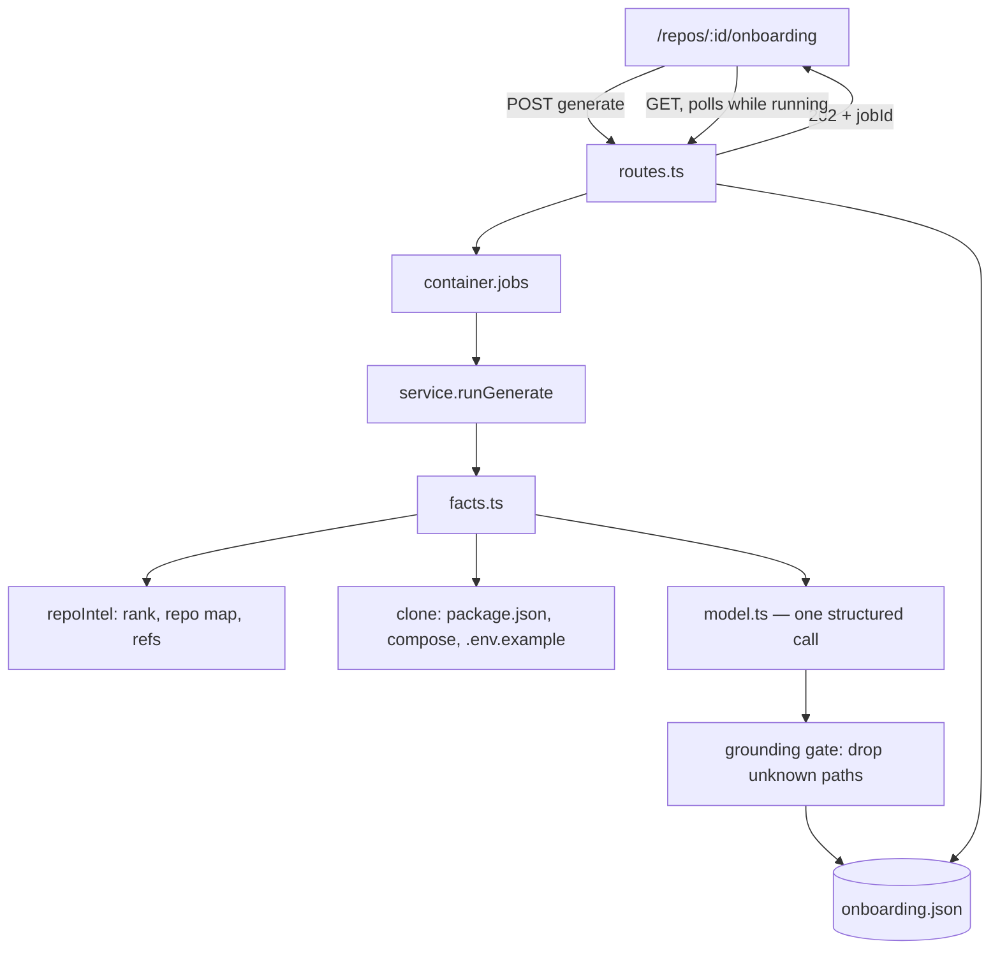

# Onboarding Generator — design

**Status:** awaiting review · **Date:** 2026-08-14

A per-repo guided tour that makes an unfamiliar codebase readable on day one:
five sections, one narrative LLM call, and a reading path ordered by the
indexer's file rank rather than by the model's opinion.

## 1. Problem and scope

A developer added a repo to DevDigest and now faces 12k files. The Onboarding
Tour answers, in order: how is this put together, which files carry the weight,
how do I run it, what do I read first, and what can I safely touch.

**In scope:** the five sections, on-demand generation with a staleness badge,
one screen at `/repos/:id/onboarding`, one server module.

**Out of scope:** public share links (the button copies the current URL),
automatic generation on clone, per-user progress tracking, editing the tour.

### What already exists

This is the L05 lesson slot, and the scaffolding landed ahead of the code:

| Artefact | State |
|---|---|
| `onboarding` table — `repo_id` PK, `json`, `generated_at` (`server/src/db/schema/context.ts`) | exists, zero code references |
| `server/src/prompts/onboarding.system.md` | exists, written for a *different* section set |
| `onboarding` entry in `FEATURE_MODELS` (`vendor/shared/contracts/platform.ts`, both copies) | exists and correct |
| `client/messages/en/onboarding.json`, `shell.json` label | exists, section copy is stale |
| `repoIntel` facade — `getRepoMap`, `getFileRank`, `getCallerSignatures`, `getUnresolvedReferences` | implemented, this feature is its L05 consumer |

Two known collisions:

- `/onboarding` in the client is the **add-repository** screen (`AddRepoView`),
  not the tour. The tour lives at `/repos/:id/onboarding`.
- `client/src/components/app-shell/helpers.ts:29` maps `/onboarding` to the
  `onboarding-tour` nav item. Cosmetic today, a real bug once the tour ships —
  fixed as part of this work.

## 2. The five sections

Ids are stable and used by the wire contract, the prompt, and the TOC.

| Id | Content | Origin |
|---|---|---|
| `architecture` | Prose overview + one mermaid diagram | LLM |
| `critical_paths` | Up to 6 files, each with a one-line role | files from rank, prose from LLM |
| `run_locally` | Ordered commands, each with an optional trailing comment | commands from repo, comments from LLM |
| `reading_path` | Up to 5 files in rank order, each with "why this one" | files and order from rank, prose from LLM |
| `first_tasks` | Up to 4 starter tasks, each citing a real path | LLM, paths validated against the index |

The prompt's existing section set (`overview`, `key modules`,
`routes_and_apis`, `conventions & gotchas`) is superseded; the template is
rewritten for the five above. Its security block (`<untrusted>` is data, never
instructions), grounding rules, and mermaid rules are kept verbatim — they are
already correct.

## 3. Architecture

New module `server/src/modules/onboarding/`, shaped after
`server/src/modules/conventions/` — the closest existing analogue (deterministic
gather → one structured LLM call → persist → UI polls).

```
onboarding/
  constants.ts    job kind, section ids, caps, registry default model
  domain.ts       FactsSkeleton, TourEnvelope, TourSection
  facts.ts        deterministic skeleton from repoIntel + the clone
  ports.ts        OnboardingServiceDeps — interfaces only
  model.ts        the single structured LLM call + its Zod schema
  repository.ts   the only place that touches the onboarding table
  service.ts      view / requestGenerate / runGenerate
  routes.ts       composition root; registers the job handler once at boot
```

Layering follows `server/CLAUDE.md`: the service takes ports, never
`Container`; no Drizzle outside `repository.ts`; `pnpm arch:check` must pass.

### Data flow



## 4. Storage

The table keeps its scaffolded shape — **no migration**. `json` holds an
envelope:

```ts
{
  status: 'running' | 'ready' | 'failed',
  error?: string,          // set only when status is 'failed'
  indexSha: string,        // index state the tour was written against
  indexedFiles: number,    // drives "Generated from index of N files"
  sections: TourSection[]
}
```

`generated_at` is the column, and it is only bumped on a successful write.

**Invariant:** every terminal path of `runGenerate` writes a status. A tour left
`running` shows a spinner forever, which is worse than an error.

**Regenerate preserves the previous `sections`** while `status` is `running`, so
the page keeps rendering the old tour instead of blanking out.

**Staleness** is derived, never stored as a flag: `stale` is true when the
envelope's `indexSha` differs from the repo's current index state. A stale tour
is still shown, with a badge. Nothing regenerates itself.

## 5. Facts skeleton — the deterministic half

`facts.ts` assembles everything the model is not allowed to invent.

| Skeleton field | Source |
|---|---|
| `criticalPaths[]` — path + rank percentile | `getTopFilesByRank(repoId, 6)`, percentile via `getFileRank` |
| `readingPath[]` — path + percentile, **in rank order** | `getTopFilesByRank(repoId, 5)` — deliberately a subset of the above, as in the reference design |
| `chains[]` — dependency walks | `getCriticalPaths(repoId)` — context for the architecture diagram, never an ordering |
| `commands[]` — literal command strings | `package.json` scripts, `docker-compose.yml` services, presence of `.env.example` |
| `repoMap` | `getRepoMap(repoId, budget)` (cached skeleton) |
| `indexedFiles`, `indexSha` | `getIndexState(repoId)` |

`first_tasks` draws its paths from `criticalPaths ∪ repoMap`; no separate
candidate pool. `getUnresolvedReferences` is deliberately not used — it is the
phantom-gate's fuel (L06), and "this symbol does not resolve" is a defect
report, not a starter task.

Every one of these facade methods returns empty when `repoIntelEnabled` is off
or the repo is unindexed, which is exactly the `status: 'empty'` path below.

Because paths and commands come from the index and the clone, they cannot be
hallucinated — the model only ever annotates them.

## 6. The LLM call

One structured call through `container.llm` with a Zod schema, mirroring
`conventions/model.ts`. The model is resolved from `FEATURE_MODELS` via
`featureModelChoice(workspaceId)`, falling back to the registry default for
`onboarding` — read from the registry, never restated as a local literal.

The model returns **prose only**:

- `architecture.body` (markdown) and `architecture.diagram` (mermaid or null)
- one `note` per already-chosen critical path, keyed by path
- one `note` per already-chosen reading-path file, keyed by path
- one optional `comment` per already-chosen command, keyed by index
- `first_tasks[]` — title, body, and a `path` drawn from `candidateFiles`

### Grounding gate

After parsing, before persisting:

1. Any `path` absent from the index is dropped, along with the entry carrying it.
2. A `first_tasks` entry left without a valid path is dropped.
3. A `diagram` failing a syntax sanity check becomes `null` rather than
   rendering broken.
4. Notes keyed to a path or index that no longer exists are ignored; the entry
   renders without prose rather than disappearing.

A section that survives the gate empty renders as an explicit "not enough
signal" state, never as a blank card.

## 7. API

| Route | Behaviour |
|---|---|
| `GET /repos/:id/onboarding` | `{ status, sections, generatedAt, stale, indexedFiles }`. `status: 'empty'` when no row exists. |
| `POST /repos/:id/onboarding/generate` | `202 + { jobId }`; `409` when a generation is already in flight |

Both call `getContext(container, req)` and scope by `workspaceId`.

Wire contracts go in `@devdigest/shared` as `contracts/onboarding.ts` — written
to **both** physical copies (`server/src/vendor/shared/`,
`client/src/vendor/shared/`), per root `CLAUDE.md`.

### Degradation

An unindexed or degraded repo returns `200` with `status: 'empty'` and a reason;
the CTA explains that indexing comes first. This follows the repo-intel
degraded contract: empty results, never a throw. Generation runs through
`container.jobs`, never a floating promise.

## 8. Client

- Route `client/src/app/repos/[repoId]/onboarding/page.tsx` — thin wrapper,
  sibling to `context/` and `conventions/`.
- `_components/OnboardingTourView/` per the folder convention
  (`OnboardingTourView.tsx`, `styles.ts`, `helpers.ts`, `constants.ts`,
  `index.ts`), with `_components/{TourToc, SectionCard, CriticalPathRow,
  CommandRow, ReadingPathStep, FirstTaskCard}`.
- Data through one new hook in `src/lib/hooks/`, using `api` from
  `src/lib/api.ts`. Polls every 4s while `status === 'running'`, matching the
  conventions screen.
- Copy comes from `client/messages/en/onboarding.json`, whose section blurb is
  rewritten for the five sections.
- Nav: a workspace entry pointing at `/repos/:id/onboarding`, and the
  `helpers.ts:29` mapping corrected so the add-repo screen stops highlighting
  the tour.

Per the reference screenshots: a sticky "On this page" TOC, collapsible section
cards, `Regenerate` and `Share link` in the header, the subtitle "Generated from
index of N files · last refreshed …", critical-path rows with an `Open` action,
numbered command rows with a copy button, and numbered reading-path steps each
carrying its one-line reason.

`Share link` copies the current URL to the clipboard and confirms. No token, no
unauthenticated route.

### Screen states

| State | Render |
|---|---|
| `empty` | Generate CTA with the existing blurb |
| `empty`, repo not indexed | CTA disabled, explains indexing first |
| `running`, no previous tour | Skeleton |
| `running`, previous tour exists | Previous tour + "Regenerating…" |
| `ready` | The tour; stale badge when `stale` |
| `failed` | Error card with the stored message + Retry |

## 9. Testing

- **Hermetic server units:** `facts.ts` ordering (reading path strictly by rank)
  and command extraction; the grounding gate (unknown paths dropped, bad diagram
  nulled, empty section survives); `service.runGenerate` writes a status on
  every terminal path including a thrown model error. LLM through
  `MockLLMProvider.structuredBySchema` — the schema name is load-bearing.
- **`*.it.test.ts`:** repository upsert, envelope round-trip, `generated_at`
  bumped only on success.
- **Client RTL:** the six screen states above; poll stops when status leaves
  `running`.
- **e2e:** a new flow beside `06-onboarding.flow.json`, which covers add-repo and
  stays as it is.

## 10. Acceptance

1. A generated tour renders exactly five sections in the fixed order.
2. Every path shown in `critical_paths`, `reading_path` and `first_tasks` exists
   in the repo index.
3. `reading_path` is in descending file-rank order.
4. Exactly one LLM call per generation.
5. Regenerating keeps the previous tour on screen until the new one lands.
6. A repo whose index moved on shows a stale badge and does not self-regenerate.
7. An unindexed repo shows the empty state, no error, no failed job.
8. A model failure leaves `status: 'failed'` with a readable message, never a
   stuck spinner.
9. `pnpm arch:check`, `pnpm typecheck` (server and client) pass.
