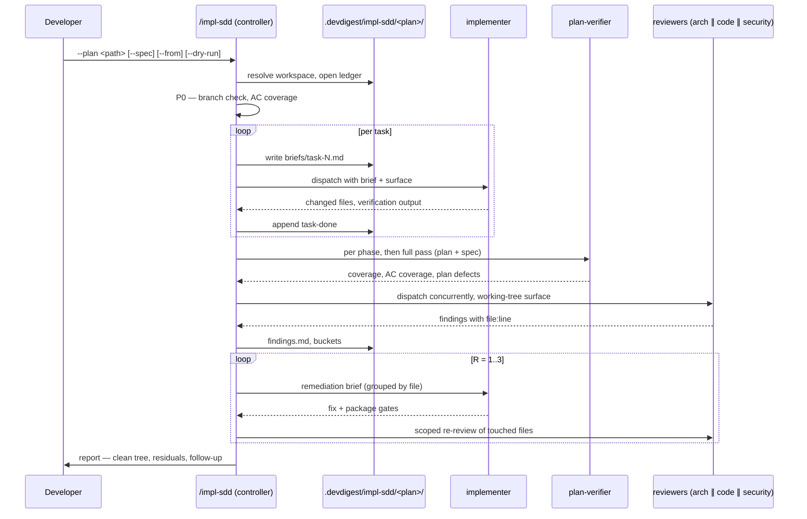

# Spec: `/impl-sdd` — plan execution with review and bounded remediation

Spec ID: SPEC-2026-08-13-impl-sdd
Status: draft
Supersedes: —
Date: 2026-08-13
Packages: repo tooling only — `.claude/`, `scripts/`, root `CLAUDE.md`, `.gitignore`
Design inputs: N/A — no user-facing surface
Related: [`.claude/agents/implementer.md`](../../../.claude/agents/implementer.md) · [`.claude/agents/plan-verifier.md`](../../../.claude/agents/plan-verifier.md) · [`.claude/agents/architecture-reviewer.md`](../../../.claude/agents/architecture-reviewer.md) · [`.claude/skills/pr-self-review/SKILL.md`](../../../.claude/skills/pr-self-review/SKILL.md) — the precedent for a multi-phase skill with helper files · [`docs/plans/README.md`](../../plans/README.md) — the spec-wins rule this document relies on

## Problem and user

The repository has seven agents with sharp contracts and no written order. A
developer who wants a plan executed has to remember which agent runs when, what
surface each reviewer needs, what to do with the findings that come back, and
when to stop. In practice that means: the reviewers get pointed at
`git diff main...HEAD` on work that was never committed and cheerfully report
`pass` on nothing; the fix loop after a review runs until someone gets bored;
each cold implementer re-reads the whole repository because nobody wrote its
brief; and a session that compacts mid-run re-dispatches tasks that already
finished.

The user is the developer running the loop — one person with a terminal, an
approved plan, and no appetite for babysitting seven hand-offs.

Two neighbouring problems are **not** this document's: writing the spec
(`specreator`) and writing the plan (`implementation-planner`). Both are run
by hand, deliberately, because both end in a human judgement — a spec is
approved, a plan is accepted — and a command that swallowed them would be
asking a human for permission twice inside its own control flow.

## Goals / Non-goals

**Goals** — one short command that takes an approved plan and returns a
working tree that has been implemented, traced against the plan and the spec,
reviewed on three axes, and remediated to a stated stopping point; a run that
survives compaction; a token budget that does not scale with the number of
cold subagents; and prohibitions strong enough that no phase can commit,
push, branch, or open a PR.

**Non-goals** — writing specs or plans; committing anything; parallel
implementers; worktree isolation; a security reviewer agent; replacing
`pr-self-review`, which stays the pre-PR gate and runs after this command
ends.

## User stories

- As a developer with an approved plan, I want one command to execute and
  review it, so that I do not hand-dispatch seven agents in the right order.
- As a developer, I want the review findings fixed in bounded rounds, so that
  the loop ends in a state I can act on rather than running until I stop it.
- As a developer whose session compacted mid-run, I want to resume where the
  work stopped, so that finished tasks are not re-run.
- As a reviewer of the result, I want every requirement traced to an artifact,
  so that "done" means the plan and the spec were both satisfied.

## Acceptance criteria (EARS)

The phase ids below are fixed, and every artifact that quotes them — the skill
body, the ledger, the remediation rules — uses these six and no others:

| Phase | What happens | Ends when |
|---|---|---|
| P0 preflight | plan and spec resolved, branch checked, workspace opened, `AC` coverage listed | the coverage list is empty, or the run stops |
| P1 execute | one brief and one implementer per task; `plan-verifier` after each plan phase | every task has a `task-done` line |
| P2 traceability | `plan-verifier` full pass over plan **and** spec | no `not satisfied` item remains, or the run stops |
| P3 review | architecture, correctness and security reviews, concurrently | `findings.md` is written |
| P4 remediation | bounded fix rounds with scoped re-review | no open `must-fix` / `fix-in-scope` finding, or round 3 ends |
| P5 handoff | the report; the working tree is left for the human | always — this is where the command stops |

| # | Requirement | Pattern | Verified by | Covered by |
|---|---|---|---|---|
| AC-1 | The system shall accept a plan path as its only required argument, and shall resolve the governing spec from the plan's `Spec:` header when `--spec` is not given. | Ubiquitous | manual observation — run with `--plan` alone; the ledger's P0 line names the resolved spec | _(implementer)_ |
| AC-2 | IF no plan path is given and none can be resolved from the arguments, THEN the system shall stop and ask, before dispatching any agent. | Unwanted behavior | manual observation — run with no arguments; no `task-start` line is written | _(implementer)_ |
| AC-3 | IF the current branch is `main`, THEN the system shall stop and ask, and shall not create, switch, or delete a branch itself. | Unwanted behavior | manual observation — run on `main`; `git rev-parse --abbrev-ref HEAD` is unchanged after the stop | _(implementer)_ |
| AC-4 | WHEN P0 runs, the system shall list — by reading the two files itself, without dispatching an agent — every spec `AC-N` that is neither claimed by a task's `Satisfies:` line nor named in the plan's `## Out of scope`, and shall not enter P1 while that list is non-empty. | Event-driven | manual observation — remove one `Satisfies:` id from a plan copy; P0 names it and stops | _(implementer)_ |
| AC-5 | WHERE `--dry-run` is given, the system shall complete P0 and stop before dispatching any implementer. | Optional feature | manual observation — the ledger ends with a P0 line and contains no `task-start` | _(implementer)_ |
| AC-6 | The system shall write one brief file per task before dispatching that task's implementer, containing the task text verbatim, the plan's `## Global Constraints`, the `AC-N` rows quoted from the spec, the `Interfaces: Consumes` signatures of earlier tasks, and the insight lines the plan header cites. | Ubiquitous | manual observation — `briefs/task-N.md` exists and contains all five parts before the dispatch | _(implementer)_ |
| AC-7 | The system shall dispatch at most one implementer at a time. | Ubiquitous | manual observation — the ledger's `task-start` and `task-done` lines never interleave | _(implementer)_ |
| AC-8 | WHEN a plan phase completes, the system shall dispatch `plan-verifier` scoped to that phase's tasks and their `Interfaces: Produces` names. | Event-driven | manual observation — one `phase-verify` ledger line per plan phase | _(implementer)_ |
| AC-9 | IF an implementer reports a conflict between the plan and the spec, or a plan defect, THEN the system shall stop and ask, and shall not resolve it by dispatching further work. | Unwanted behavior | manual observation — seed a plan task that contradicts an `AC-N`; the run stops with the conflict quoted | _(implementer)_ |
| AC-10 | The system shall verify a task with the touched package's typecheck and the specific test files the task names, and shall verify a plan phase with that package's full test lane plus `arch:check` when `server/` was touched. | Ubiquitous | manual observation — the ledger's task lines carry the targeted command, the phase lines the full lane | _(implementer)_ |
| AC-11 | IF a verification command exits non-zero, THEN the system shall record at most 30 lines of its output verbatim in the ledger and shall not mark the task done. | Unwanted behavior | manual observation — break a test deliberately; the ledger holds ≤30 lines and no `task-done` | _(implementer)_ |
| AC-12 | WHEN every task is done, the system shall dispatch `plan-verifier` with both the plan and the spec as item sources. | Event-driven | manual observation — the P2 ledger line names both paths | _(implementer)_ |
| AC-13 | WHILE any `not satisfied` item remains from P2, the system shall return to P1 for the tasks that own those items only, at most twice, and then stop and ask. | State-driven | manual observation — the ledger shows at most two P1 re-entries before a stop | _(implementer)_ |
| AC-14 | WHEN P3 runs, the system shall dispatch the architecture reviewer, the correctness review and the security review concurrently, each given the working tree as its stated surface — `git status --porcelain` plus `git diff` plus the untracked paths from the plan's `## File Structure`. | Event-driven | manual observation — each dispatch prompt contains the surface paragraph; no dispatch names `main...HEAD` | _(implementer)_ |
| AC-15 | The system shall record every finding in `findings.md` with a stable id, its source reviewer, its severity, and its `file:line`. | Ubiquitous | manual observation — `findings.md` after a run with at least one finding | _(implementer)_ |
| AC-16 | The system shall place every finding in exactly one of `must-fix`, `fix-in-scope`, `defer`, `conflict` before dispatching any remediation. | Ubiquitous | manual observation — every id in `findings.md` carries exactly one bucket | _(implementer)_ |
| AC-17 | IF a finding names only files absent from every task's `Files:` list, THEN the system shall place it in `defer` and shall not dispatch a fix for it. | Unwanted behavior | manual observation — seed a finding on an untouched file; no remediation brief names it | _(implementer)_ |
| AC-18 | WHEN a remediation round completes WHILE findings remain open, the system shall dispatch a re-review scoped to the files that round touched, naming the finding ids to re-judge. | Complex | manual observation — the re-review prompt lists only round-touched paths and the open ids | _(implementer)_ |
| AC-19 | IF three remediation rounds complete with any `must-fix` or `fix-in-scope` finding still open, THEN the system shall stop and present the residuals with the four options — amend the spec, amend the plan, waive with a recorded reason, defer as follow-up — and shall not dispatch a fourth fix round. | Unwanted behavior | manual observation — the ledger holds exactly three `round` lines before the stop | _(implementer)_ |
| AC-20 | WHEN a remediation round has touched a file that carries `AC-N` coverage, the system shall re-run `plan-verifier` for those items before entering P5. | Event-driven | manual observation — a `phase-verify` line follows the last `round` line | _(implementer)_ |
| AC-21 | IF a finding contradicts the spec or the plan, THEN the system shall place it in `conflict`, stop, and ask. | Unwanted behavior | manual observation — the run stops and quotes both sides | _(implementer)_ |
| AC-22 | The system shall append one line per event to a ledger file, in the form `<ISO8601> · <Pn> · <event> · <subject> · <outcome>`, and shall never rewrite or truncate a line already written. | Ubiquitous | manual observation — the ledger grows monotonically across a run; a resumed run appends rather than replaces | _(implementer)_ |
| AC-23 | WHERE `--from <Pn>` is given, the system shall read the ledger and skip every task that already has a `task-done` line. | Optional feature | manual observation — resume a half-finished run; no completed task is re-dispatched | _(implementer)_ |
| AC-24 | The system shall not commit, stage, push, create or switch a branch or worktree, flip a spec's `Status:`, run `arch:baseline`, or run `docker compose down -v`, in any phase. | Ubiquitous | manual observation — `git status` shows the same HEAD before and after a full run; the prohibitions are listed in the skill body | _(implementer)_ |
| AC-25 | The system shall resolve every run artifact under `.devdigest/impl-sdd/<plan-basename>/`, built with `path.join`, and that directory shall be git-ignored. | Ubiquitous | hermetic unit — `node --test "scripts/*.test.mjs"`; plus `git check-ignore -v` on a ledger path | _(implementer)_ |
| AC-26 | IF a plan path escapes the repository or contains `..`, THEN the workspace resolver shall throw rather than create a directory. | Unwanted behavior | hermetic unit — `node --test "scripts/*.test.mjs"` | _(implementer)_ |
| AC-27 | `plan-verifier` shall accept `docs/superpowers/specs/SPEC-*.md` as an item source, taking every `AC-N` row as one item, and shall report an `AC coverage:` line naming the ids no task claims. | Ubiquitous | manual observation — run it against this spec and a plan; the report carries the line | _(implementer)_ |
| AC-28 | Root `CLAUDE.md` shall state which superpowers skills this workflow uses and which it does not, naming for each excluded skill the behaviour that excludes it. | Ubiquitous | manual observation — the `## Superpowers` section lists all four exclusions with reasons | _(implementer)_ |
| AC-29 | `mcp/` shall appear in the implementer's command table, in `pr-self-review`'s routing globs, and in the architecture reviewer's boundary list. | Ubiquitous | manual observation — `grep -n "mcp/" ` on the three files returns a hit in each | _(implementer)_ |
| AC-30 | `plan-verifier` shall run on `sonnet`. | Ubiquitous | manual observation — `model: sonnet` in its frontmatter, and one full P2 pass whose rows still carry `file:line` evidence and the four-value status vocabulary | _(implementer)_ |
| AC-31 | IF a reviewer fails, times out, or returns output that does not parse, THEN the system shall retry it exactly once, and if the retry also fails shall record that axis as `not reviewed: <axis> — <reason>`, proceed to P4 with the findings it has, and report the run's outcome as `incomplete — <axis> not reviewed`. | Unwanted behavior | manual observation — force one reviewer to fail; the ledger holds one retry line, `findings.md` holds no `review-failed` finding, and the P5 report leads with the gap | _(implementer)_ |
| AC-32 | IF every reviewer fails after its retry, THEN the system shall stop at P3 and shall not enter P4. | Unwanted behavior | manual observation — no `round` line is written | _(implementer)_ |

## Edge cases

| # | Case | Expected behaviour | AC |
|---|---|---|---|
| E1 | The plan cites no spec (`Spec: none — behaviour stated in the request`) | P0 proceeds; the AC-coverage check reports `no spec — coverage not checked` and does not block | AC-4 |
| E2 | The working tree is dirty before the run | Recorded in the P0 ledger line, not a stop — the same rule `pr-self-review` uses | AC-22 |
| E3 | A task's `Verify:` names a command that no `package.json` defines | Plan defect: stop and ask, do not substitute a plausible command | AC-9 |
| E4 | A reviewer returns no findings at all | P4 is skipped; the ledger records `round · R0 · no findings` and the run proceeds to P5 | AC-16 |
| E5 | Every finding lands in `defer` | No remediation dispatch; all of them are carried into the P5 report as follow-up | AC-17 |
| E6 | Two reviewers report the same defect at the same `file:line` | One finding id, both sources named, the higher severity kept | AC-15 |
| E7 | `arch:check` reports the 24 frozen violations | A pass. A frozen violation is never a finding and never a remediation target | AC-16 |
| E8 | A remediation fix breaks a test that passed in P1 | The round's package gates fail; the round does not close, and the failure is a new finding in the same round | AC-11 |
| E9 | The ledger exists but names a different plan | Refuse to resume; the workspace is per-plan and another plan's directory is never read or written | AC-23 |
| E10 | The plan has one task and no phases | P1 and its phase verification collapse into one step; P2 still runs | AC-8 |
| E11 | A task touches both `vendor/shared` copies | The task's verify runs both packages' typechecks, per the plan's own `Verify:` line | AC-10 |
| E12 | An implementer returns having ticked no checkbox | Not an error by itself; P2 verifies artifacts, not ticks, and a tick is never evidence | AC-12 |

## Decisions and assumptions

| Question | Answer | Settled by | Affects |
|---|---|---|---|
| Does the command also run `specreator` and `implementation-planner`? | No — both are run by hand. The command starts from an approved plan. | caller | AC-1, whole phase spine |
| Where does the run stop by default? | After remediation, at a clean working tree. The human commits and runs `/pr-self-review`. | caller | AC-24, P5 |
| Spec format for this feature | `SPEC-*.md` with EARS and `AC-N`, not the legacy prose design doc | caller | this document |
| What else ships in v1 | `plan-verifier` learns `SPEC-*.md`; the superpowers policy in `CLAUDE.md`; the `mcp/` routing holes | caller | AC-27, AC-28, AC-29 |
| Is there an escape hatch that skips the spec? | No. A workflow whose first input is optional stops being spec-driven, and a change too small for a spec is too small for this command. | caller | AC-1 |
| Who orchestrates — this skill, or `superpowers:subagent-driven-development`? | This skill. SDD dispatches `general-purpose` subagents with its own implementer prompt, bypassing this repo's implementer and its guardrails, and its implementer template commits per task. | default applied | AC-6, AC-7, AC-24 |
| Remediation round cap | 3, then stop with four options rather than a fourth fix | default applied | AC-19 |
| Parallelism | Sequential implementers; reviewers concurrent because they are read-only | default applied | AC-7, AC-14 |
| Command name | `impl-sdd` | caller | — |
| Which model runs `plan-verifier` | `sonnet` — mechanical item-to-artifact matching with a closed status vocabulary, the same reasoning that pinned `researcher` | caller | AC-30 |
| A reviewer that fails or returns garbage | Retry once, then a named coverage gap and an `incomplete` outcome — not a finding, and not a block. Blocking would discard two completed axes; a finding would dispatch an implementer at a problem no code change can fix. All three failing is the hard stop. | default applied — one word from the caller flips it to a hard stop at P3 | AC-31, AC-32 |

## Design review

No design comp exists and none was supplied: the feature has no user-facing
surface, so `Design inputs` is `N/A` and there is nothing to reconcile against
a mockup.

Two contradictions with existing material were found and resolved in writing:

- **`superpowers:brainstorming` writes `docs/superpowers/specs/YYYY-MM-DD-<topic>-design.md` and commits it.** That folder is now `specreator`'s, holding `SPEC-*.md` with EARS rows, and no agent in this repository commits. Resolved in favour of the repository: this spec is written in the `SPEC-*` format and is not committed by the agent that wrote it. The general rule becomes AC-28.
- **`superpowers:executing-plans` step 1 requires a worktree and step 3 hands off to `finishing-a-development-branch`.** [`implementer.md:87-97`](../../../.claude/agents/implementer.md#L87-L97) already refuses both. Resolved in favour of the implementer: `/impl-sdd` never creates a worktree and never finishes a branch (AC-24).

One repository fact drove a requirement that a naive design would have missed:
nothing is committed during a run, so the branch diff a reviewer would normally
take is empty. AC-14 therefore makes the working tree the stated surface, and
E7 keeps the frozen `arch:check` violations out of the findings.

## Module interactions

The command is a controller in the main session. It produces briefs and reads
reports; the agents produce code and verdicts. Nothing here calls anything
else directly — every arrow is a dispatch by the controller.

Per hop, when the other side is unavailable or silent:

| Hop | If it fails, is slow, or returns nothing |
|---|---|
| controller → workspace script | The run stops at P0. Without a ledger there is no resumable run, and a run that cannot be resumed is worse than one that never started. |
| controller → implementer | The task keeps no `task-done` line, so a resume re-dispatches exactly that task. A partially-applied task is reported, never assumed complete. |
| controller → plan-verifier | Its `not verifiable` rows are carried into the report verbatim with the command that would close them; the run does not treat an unverifiable item as satisfied. |
| controller → a reviewer | Retried once, then recorded as a **coverage gap** — `not reviewed: <axis>` — never as a finding, because a finding is by definition something an implementer can act on and a crashed reviewer is not. The other two axes still remediate, and the run's outcome word changes to `incomplete` (AC-31). All three down is the one hard stop (AC-32). An unreviewed surface must never report as reviewed; here the mechanism is the disclosure, not a block. |
| reviewer → `arch:check` | If the gate cannot run, the architecture verdict is `not reviewed` for the boundaries that depend on it, and the report says so. |

## Non-functional requirements

| Row | Statement |
|---|---|
| Performance | The controller's own work is file I/O and dispatch; the cost is the subagents. One brief per task, one dispatch per task, one scoped re-review per round — no phase re-reads the repository on the controller's behalf. |
| Cost | Every phase runs models. The levers are fixed: briefs replace re-reading (AC-6), targeted tests replace full lanes at task level (AC-10), grouped remediation replaces one dispatch per finding (AC-16), and the scoped re-review replaces a full branch re-review each round (AC-18). Sequential execution means cost scales with task count, not with concurrency. |
| Limits & quotas | Remediation is capped at 3 rounds (AC-19); P2→P1 re-entry at 2 (AC-13); verification output at 30 lines (AC-11). A plan with more tasks than the caller wants to pay for is the caller's call — the command states the task count at P0 and does not cap it. |
| Concurrency & idempotency | One implementer at a time (AC-7); reviewers concurrent (AC-14). Re-running the command on a finished run is a no-op that re-reads the ledger and reports; `resolveWorkspace` never truncates an existing ledger (AC-22). |
| Degradation | No plan → stop (AC-2). No spec → run without coverage checking (E1). One or two reviewers down → one retry each, then a named coverage gap and an `incomplete` outcome (AC-31); all three → stop (AC-32). `arch:check` unavailable → `not reviewed` for the boundaries that need it, stated. Nothing degrades into silence — the outcome word carries the disclosure, which is the same reason `uncomparable_prs` exists in the product. |
| Security & tenancy | No workspace, no tenancy, no HTTP surface — `N/A` for `workspaceId` scoping. The security-relevant property is that plan and spec files are **model-generated input**: see `## Untrusted inputs`. |
| Data retention & privacy | Run artifacts live in a git-ignored directory and are never committed (AC-25). Verification output is capped and may contain paths but must not carry secrets — nothing from `~/.devdigest/secrets.json` or `DEVDIGEST_CLONE_DIR` is read by any phase. |
| Accessibility | N/A — no user interface. |
| i18n | N/A — no user-facing strings. |
| Observability | The ledger is the operator's view: one line per event, append-only, readable cold after a compaction (AC-22). A failure looks like a phase line with a non-zero result and ≤30 lines of output beneath it. |
| Migration & rollout | No schema, no data. The only migration concern is that `.devdigest/impl-sdd/` must be git-ignored before the first run, or the first run dirties the tree. |
| Rollback | Delete `.claude/skills/impl-sdd/` and the `.gitignore` line. The agents it dispatches are unchanged by its removal — the command adds order, not capability. The `plan-verifier` and `CLAUDE.md` changes stand on their own and are not rolled back with it. |

## Inputs and provenance

| Input | Source | Shape | Where validated |
|---|---|---|---|
| `--plan <path>` | the developer | repo-relative path to `docs/superpowers/plans/*.md` | `slugFor` in the workspace script — rejects `..` and absolute paths (AC-26) |
| `--spec <path>` | the developer, or the plan's `Spec:` header | repo-relative path to a spec | read-only; absence is a stated degradation (E1) |
| `--from <Pn>` | the developer | one of the phase ids | matched against the fixed phase list; anything else stops |
| plan body | `implementation-planner` — **model output** | markdown: `## Global Constraints`, `## File Structure`, `## Task N` with `Files:` / `Interfaces:` / `Skills:` / `Verify:` / `Satisfies:` | structurally, at P0: a task missing `Files:` is a plan defect, not a guess |
| spec body | `specreator` — **model output** | `AC-N` rows, `Verified by` lanes | at P0, for the coverage check only |
| implementer report | `implementer` — **model output** | changed files, verification output, deviations, plan defects | claims are not evidence: P2 re-verifies artifacts, and a ticked checkbox proves nothing |
| reviewer findings | three reviewers — **model output** | `file:line`, severity, confidence, rule | grounding: a finding whose cited line is absent from the working-tree diff is discarded, not downgraded |
| `git` state | the repository | branch name, porcelain status, diff | read-only inspection only |

## Untrusted inputs

| Input | Why untrusted | Containment |
|---|---|---|
| Plan and spec file bodies | Written by a model, and editable by anyone with repo access. Their `Files:` paths and `Verify:` commands are the ones the controller acts on. | `Verify:` lines are run as written and never synthesised; a command absent from the package's `package.json` is a plan defect that stops the run (E3). Paths from the plan are used to name files, never interpolated into a shell string built by concatenation. |
| The plan path argument | Reaches the filesystem directly and names the directory the run creates. | `slugFor` throws on `..` or an absolute prefix; the workspace root is always under `.devdigest/impl-sdd/` and is built with `path.join` (AC-25, AC-26). |
| Implementer and reviewer reports | Model output, quoted into the ledger and into remediation briefs. | Quoted, never executed. Findings must carry a `file:line` that exists in the working-tree diff or they are discarded — the same grounding gate `pr-self-review` applies and `reviewer-core` applies to the product's own review output. |
| Verification command output | May contain arbitrary repository content, including paths and error text. | Capped at 30 lines (AC-11) and written to a git-ignored file. Never fed back into a prompt as an instruction. |

## Proposals (not requirements)

- **Problem:** the same run report is retyped into a PR description ten minutes later. **Proposal:** P5 writes a PR-ready summary block to `reports/` for `pr-self-review` to pick up. **Cost:** couples two skills that are currently independent; do it only if the handoff proves annoying in practice.
- **Problem:** the command has no spec of its own until now, and this one was written by hand rather than by `specreator`. **Proposal:** once `/impl-sdd` works, re-run `specreator` over this file as an amendment pass. **Cost:** one specreator cycle.
- **Problem:** wide plans are slow because tasks run sequentially. **Proposal:** allow parallel implementers for tasks in different packages with no `Interfaces:` dependency. **Cost:** one Postgres container, one clone directory and five `node_modules` are shared — the isolation problem has to be solved first.

## Open questions

1. **Does `--mode multi|single` earn its place?** The plan already records the execution mode its planner chose, and this command reads it. The flag exists only to override that. If nobody overrides it in the first month, remove it.
2. **Is one retry the right number for a failed reviewer (AC-31)?** One covers the transient failures — timeout, a truncated response, a malformed table. It does not cover a reviewer that is failing deterministically on this particular surface, where the second attempt is pure cost. Closing it needs a handful of real runs; until then one is the cheaper guess.
