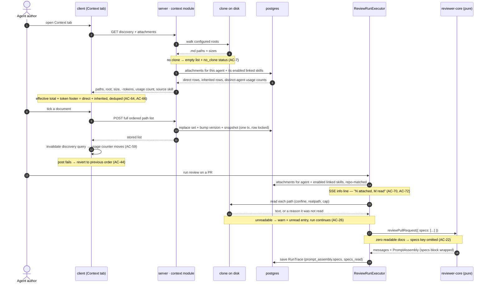

# Spec: Project Context — attaching repository documents to agents and skills

Spec ID: SPEC-2026-08-13-project-context
Status: draft
Supersedes: —
Date: 2026-08-13
Packages: server, client (`reviewer-core` unchanged — see §Module interactions)
Design inputs: no image file was supplied. Four mockups were pasted inline in chat and transcribed in full to a scratchpad file (`project-context-design-notes.md`, session-local, not in the repository); that transcription is what this spec was written against. Screen 1 = Project Context page, screen 2 = agent editor `Context` tab, screen 3 = skill editor `Project context to use`, screen 4 = run trace drawer. Nothing was rendered, so no claim below rests on pixels — spacing, contrast, focus rings and real truncation were not observable and are specified as behaviour instead.
Related: [`reviewer-core/src/prompt.ts`](../../../reviewer-core/src/prompt.ts) (`PromptParts.specs`, `wrapUntrusted`, `INJECTION_GUARD`) · [`server/src/vendor/shared/contracts/trace.ts`](../../../server/src/vendor/shared/contracts/trace.ts) + [`client/src/vendor/shared/contracts/trace.ts`](../../../client/src/vendor/shared/contracts/trace.ts) (`RunTrace`, `PromptAssembly`) · [`server/src/vendor/shared/contracts/platform.ts`](../../../server/src/vendor/shared/contracts/platform.ts) + [`client/src/vendor/shared/contracts/platform.ts`](../../../client/src/vendor/shared/contracts/platform.ts) (`SpecFile`, `IndexStatus`, `Settings`) · [`server/specs/skills.md`](../../../server/specs/skills.md) (the attachment model this mirrors and the one rule it deliberately breaks) · [`server/specs/intent.md`](../../../server/specs/intent.md) (the doc-reading precedent) · [`docs/agent-prompts/README.md`](../../agent-prompts/README.md) (§"How a prompt is assembled") · expected halves: `server/specs/project-context.md`, `client/specs/project-context.md` (both `doc-writer`'s, written later)

## Problem and user

A reviewer agent knows the diff and, since repo-intel landed, something about the
code around it. It knows nothing about what the project decided. The PRD that
says rate limiting must be per-API-key, the security baseline that forbids
logging request bodies, the incident write-up explaining why a retry loop was
capped at three — all of that lives in `.md` files sitting in the repository the
agent is reviewing, and none of it reaches the model. So the agent reports
style-grade findings against code whose real defect is that it contradicts a
document two directories away, and the reviewer who *has* read that document has
to catch it by hand, every time.

The user is the person configuring agents in Skills Lab. They know which
documents matter for which agent — they wrote most of them. What they cannot do
today is tell the system, and they cannot see afterwards whether it worked.

## Goals / Non-goals

**Goals**

- Find every `.md` document in the repository clone under configurable roots and
  show them in one place.
- Let the user attach chosen documents, by hand, to an agent or to a skill, in an
  order they control.
- Show, before a run, how many tokens each attachment will add — and on a
  map-reduce agent, that the block is re-sent per file.
- At run time, read the attached files and inject their **text** into the
  existing `## Project context` prompt slot as untrusted, delimiter-wrapped data.
- Make the result auditable: the run trace names every document read, its token
  size, every document *not* read and why, and the full text that was assembled.

**Non-goals** — deliberately not done, so nobody widens the change:

- **Automatic, PR-content-driven document selection.** v1 is manual only. A
  selector that picks documents from the diff is a separate, later feature.
- **Editing documents in the app.** The comp's `Preview | Edit` toggle and the
  `editor.save` key already in `client/messages/en/context.json` are not
  implemented: `GitClient` has `readFile` and no write method
  ([`server/src/vendor/shared/adapters.ts:205-228`](../../../server/src/vendor/shared/adapters.ts)),
  and `GitClient.sync` fast-forwards the working tree to `origin/<defaultBranch>`,
  so a local edit is destroyed on the next resync.
- **Chunking and embedding.** The comp's `1,240 chunks` footer would come from
  `code_chunks` — a table with **zero code references** outside the schema barrel
  ([`server/src/db/schema/context.ts:31`](../../../server/src/db/schema/context.ts),
  referenced only at
  [`server/src/db/schema.ts:36`](../../../server/src/db/schema.ts) and `:73`).
  `IndexStatus.chunks_indexed`
  ([`platform.ts:313-318`](../../../server/src/vendor/shared/contracts/platform.ts))
  is produced by nothing. Neither is fed here.
- **The coverage metric.** The comp's `78 COVERAGE` gauge has no definition
  anywhere in the repository. The nearest concept belongs to an unbuilt
  conformance feature (`client/messages/en/conformance.json:5`).
- **The ad-hoc review path.** `POST /reviews/adhoc`
  ([`server/src/modules/reviews/service.ts:93-156`](../../../server/src/modules/reviews/service.ts))
  is stateless and has neither a repository nor a pull request, so there is
  nothing to resolve an attachment against. It is unchanged.
- **A Settings panel control for the search roots.** The `context_roots` key is
  typed and validated (AC-74, AC-75), but v1 changes it through `PUT /settings`
  only — there is no UI for it, and that is zero client work rather than an
  omission. Named as Proposal 6.
- **Any change to `reviewer-core`.** The `specs` slot, its `wrapUntrusted`
  wrapping and its `## Project context` heading already exist and are used as-is.

## User stories

- As an agent author, I want to see every spec, doc and insight file in this
  repository in one list, so that I can tell what context is even available.
- As an agent author, I want to tick the two documents my Security Reviewer
  always needs, so that it stops flagging deliberate decisions.
- As an agent author, I want to see the token cost of an attachment before I
  make it, so that I can decide whether a 12 KB PRD is worth the spend on every
  review.
- As a skill author, I want documents attached to a skill so that every agent
  using that skill inherits them, so that I configure the pairing once.
- As an agent author, I want the agent's Context tab to show what it inherits
  from its linked skills as well as what I attached directly, so that the count
  and the token figure I read are the ones the run will actually use.
- As someone tidying up documents, I want each document to say how many agents
  it reaches, so that I can tell a document that is doing work from one nobody
  attached.
- As a reviewer reading a run, I want to expand `Project context — attached
  specs` and read exactly what the model was sent, so that I can tell a bad
  finding caused by missing context from one caused by a bad prompt.
- As a reviewer reading a run, I want a document that could not be read to be
  named as unread, so that an empty context section never reads as "there was
  nothing to say".

## Acceptance criteria (EARS)

### Discovery — the reader

| # | Requirement | Pattern | Verified by | Covered by |
|---|---|---|---|---|
| AC-1 | The system shall enumerate files with a `.md` extension (case-insensitive) inside the repository clone whose repo-relative path contains one of the configured root directory names as a path segment at any depth. | Ubiquitous | hermetic unit | _(implementer)_ |
| AC-2 | The system shall return every discovered path repo-relative and separator-normalised to forward slashes on every operating system. | Ubiquitous | hermetic unit — asserts a **nested** path, so a separator bug can surface | _(implementer)_ |
| AC-3 | The system shall resolve the search roots from the `settings` row whose key is `context_roots` and which is visible to the requesting workspace, using `specs`, `docs`, `insights` when no such row exists. | Ubiquitous | `*.it.test.ts` | _(implementer)_ |
| AC-4 | The system shall exclude the directories `.git`, `node_modules`, `dist`, `build`, `.next`, `coverage`, `out` and `vendor` from the walk. | Ubiquitous | hermetic unit | _(implementer)_ |
| AC-5 | The system shall not traverse a symbolic link during the walk. | Ubiquitous | hermetic unit | _(implementer)_ |
| AC-6 | WHEN the document list is requested, the system shall return for each document its repo-relative path, its root segment, its byte size, and a token estimate produced by the shared `Tokenizer` port. | Event-driven | `*.it.test.ts` | _(implementer)_ |
| AC-7 | IF the repository row's `clone_path` is null or the directory is absent, THEN the system shall return an empty document list carrying a machine-readable `no_clone` status and HTTP 200, never a 5xx. | Unwanted behavior | `*.it.test.ts` | _(implementer)_ |
| AC-8 | IF the walk discovers more than 500 documents, THEN the system shall return the first 500 by ascending path and a count of those omitted. | Unwanted behavior | hermetic unit | _(implementer)_ |
| AC-9 | WHEN the document list is requested, the system shall include for each document its usage count as defined by AC-57. | Event-driven | `*.it.test.ts` | _(implementer)_ |

### Attachment — persistence

| # | Requirement | Pattern | Verified by | Covered by |
|---|---|---|---|---|
| AC-10 | The system shall persist an attachment as owner kind, owner id, repository id, repo-relative POSIX path and an integer order, and shall not persist the document's text. | Ubiquitous | `*.it.test.ts` | _(implementer)_ |
| AC-11 | The system shall accept an attachment for any discovered path regardless of that document's size. | Ubiquitous | `*.it.test.ts` | _(implementer)_ |
| AC-12 | WHEN an agent's attachment set is replaced, the system shall increment `agents.version` and write one `agent_versions` snapshot recording the ordered paths. | Event-driven | `*.it.test.ts` | _(implementer)_ |
| AC-13 | WHEN two requests replace the same agent's attachment set concurrently, the system shall perform the read, the write and the snapshot inside one database transaction with the agent row locked for update, so that each request produces its own version number and its own snapshot. | Event-driven | `*.it.test.ts` — both orderings, repeated, per `server/INSIGHTS.md` 2026-08-03 | _(implementer)_ |
| AC-14 | IF an attachment route addresses an agent, skill or repository belonging to another workspace, THEN the system shall respond 404. | Unwanted behavior | `*.it.test.ts` | _(implementer)_ |
| AC-15 | WHEN a repository is deleted, the system shall delete its attachments. | Event-driven | `*.it.test.ts` | _(implementer)_ |

### Injection — the run

| # | Requirement | Pattern | Verified by | Covered by |
|---|---|---|---|---|
| AC-16 | WHEN a review run starts for a pull request, the system shall read the documents attached to the run's agent and to each of its enabled linked skills whose attachment repository id equals the pull request's repository id, and pass their text to `reviewPullRequest` as the `specs` array. | Event-driven | `*.it.test.ts` with a real clone fixture | _(implementer)_ |
| AC-17 | The system shall order the `specs` array as: agent-attached documents in their stored order, followed by skill-inherited documents in linked-skill order and, within each skill, in that skill's stored order. | Ubiquitous | hermetic unit | _(implementer)_ |
| AC-18 | The system shall include each normalised path at most once in the `specs` array, keeping the first occurrence in the order defined by AC-17. | Ubiquitous | hermetic unit | _(implementer)_ |
| AC-19 | IF an attachment's repository id differs from the pull request's repository id, THEN the system shall not read it and shall not name it in the trace. | Unwanted behavior | `*.it.test.ts` | _(implementer)_ |
| AC-20 | WHILE a linked skill is disabled, the system shall exclude that skill's attached documents from every agent's prompt. | State-driven | hermetic unit | _(implementer)_ |
| AC-21 | WHERE the agent has `repo_intel` set to false, the system shall still read and inject its attached documents. | Optional feature | `*.it.test.ts` | _(implementer)_ |
| AC-22 | WHEN a run resolves zero readable documents, the system shall omit the `specs` key from the `reviewPullRequest` input so that the assembled prompt is byte-identical to one produced before this feature existed. | Event-driven | hermetic unit — byte comparison of two assembled prompts | _(implementer)_ |
| AC-23 | The system shall pass each document's text through `wrapUntrusted` before it reaches the model, by passing it into the `specs` slot and making no other change to prompt assembly. | Ubiquitous | hermetic unit | _(implementer)_ |
| AC-24 | IF a document's content exceeds 65 536 bytes, THEN the system shall inject the first 65 536 bytes followed by the literal marker `[truncated: 65536 of <total> bytes]` and emit one Live Log line naming the path. | Unwanted behavior | hermetic unit | _(implementer)_ |
| AC-25 | IF more than 20 documents resolve for one run, THEN the system shall read the first 20 in the AC-17 order, shall not read the rest, and shall name each unread path in `specs_read` with the reason. | Unwanted behavior | hermetic unit | _(implementer)_ |
| AC-26 | IF an attached document cannot be read, THEN the system shall continue the run, name the path in `specs_read` with the reason, and emit one Live Log `warn` line naming it. | Unwanted behavior | `*.it.test.ts` | _(implementer)_ |
| AC-27 | IF a document's path resolves outside the clone root by lexical resolution against the unresolved root, THEN the system shall not open it and shall record it as unread with the reason `path resolves outside the repository`. | Unwanted behavior | hermetic unit | _(implementer)_ |
| AC-28 | IF a document's real path, resolved through every symbolic link including a symlinked ancestor directory, lies outside the clone root's own real path, THEN the system shall not read its bytes and shall record it as unread with the reason `path resolves outside the repository`. | Unwanted behavior | hermetic unit — needs a symlink fixture | _(implementer)_ |
| AC-29 | IF reading the attached documents throws for any reason, THEN the system shall complete the run without a `## Project context` section rather than fail it. | Unwanted behavior | hermetic unit | _(implementer)_ |
| AC-30 | WHEN a review run starts WHILE the repository has no clone on disk, the system shall omit the `## Project context` section and record every attached path in `specs_read` as unread with the reason `no repository clone on disk`. | Complex | `*.it.test.ts` | _(implementer)_ |

### Trace — transparency

| # | Requirement | Pattern | Verified by | Covered by |
|---|---|---|---|---|
| AC-31 | WHEN a run reads a document, the system shall add one `specs_read` entry formatted `<path> (~<n> tokens)`, where `<n>` is produced by the same `Tokenizer` port the editor uses. | Event-driven | `*.it.test.ts` | _(implementer)_ |
| AC-32 | WHEN a run does not read an attached document, the system shall add one `specs_read` entry formatted `<path> — not read: <reason>`. | Event-driven | hermetic unit | _(implementer)_ |
| AC-33 | The system shall leave `RunTrace` structurally unchanged, keeping `specs_read` as an array of strings, so that traces persisted before this feature remain valid under the unchecked `row.trace as RunTrace` read at `server/src/modules/reviews/repository/run.repo.ts:227`. | Ubiquitous | hermetic unit — parse an archived trace fixture against the contract | _(implementer)_ |
| AC-34 | WHEN at least one document is read, the system shall leave `prompt_assembly.specs` non-null in the persisted trace. | Event-driven | `*.it.test.ts` | _(implementer)_ |
| AC-35 | The system shall render the persisted `prompt_assembly.specs` block in the trace drawer under a label naming it as attached specs and as untrusted, replacing the current `Project context (dynamic)` string at `client/messages/en/runs.json:53`. | Ubiquitous | hermetic unit (client vitest + jsdom) | _(implementer)_ |

### Project Context page

| # | Requirement | Pattern | Verified by | Covered by |
|---|---|---|---|---|
| AC-36 | The system shall present a repository-scoped Project Context page listing the discovered documents and rendering the selected one read-only. | Ubiquitous | hermetic unit (client vitest + jsdom) | _(implementer)_ |
| AC-37 | The system shall not present any control on that page that edits or saves a document. | Ubiquitous | hermetic unit (client vitest + jsdom) — assert the absence of an edit affordance | _(implementer)_ |
| AC-38 | The system shall show a page footer stating the document count and the time of the last scan, and shall show neither a chunk count nor a coverage figure. | Ubiquitous | hermetic unit (client vitest + jsdom) | _(implementer)_ |
| AC-39 | WHEN the user activates the rescan control, the system shall re-run discovery and update the list and the footer timestamp. | Event-driven | hermetic unit (client vitest + jsdom) | _(implementer)_ |
| AC-40 | IF discovery returns the `no_clone` status, THEN the page shall render an explanatory empty state naming the repository as not cloned, and not an error state. | Unwanted behavior | hermetic unit (client vitest + jsdom) | _(implementer)_ |
| AC-41 | IF discovery returns zero documents for a cloned repository, THEN the page shall render an empty state naming the configured roots that were searched. | Unwanted behavior | hermetic unit (client vitest + jsdom) | _(implementer)_ |

### Agent and skill Context tabs

| # | Requirement | Pattern | Verified by | Covered by |
|---|---|---|---|---|
| AC-42 | The system shall present a `Context` tab in the agent editor and a `Project context to use` section in the skill editor, each listing the discovered documents with a checkbox, the repo-relative path, its root segment, a kind chip and a preview control. | Ubiquitous | hermetic unit (client vitest + jsdom) | _(implementer)_ |
| AC-43 | WHEN the user toggles or reorders a row, the system shall post the complete ordered attachment list immediately, with no separate save control. | Event-driven | hermetic unit (client vitest + jsdom) | _(implementer)_ |
| AC-44 | IF that post fails, THEN the system shall restore the list to its pre-toggle order and show an error message. | Unwanted behavior | hermetic unit (client vitest + jsdom) | _(implementer)_ |
| AC-45 | The system shall render attached rows above unattached rows, make only attached rows draggable, and order unattached rows by root segment then path. | Ubiquitous | hermetic unit (client vitest + jsdom) | _(implementer)_ |
| AC-46 | WHEN the filter input is non-empty, the system shall show only rows whose repo-relative path contains the filter text, compared case-insensitively. | Event-driven | hermetic unit (client vitest + jsdom) | _(implementer)_ |
| AC-47 | The system shall show a footer stating a summed token estimate for the attachments, prefixed to mark it as approximate. | Ubiquitous | hermetic unit (client vitest + jsdom) | _(implementer)_ |
| AC-48 | WHERE the agent's strategy can select map-reduce, the system shall state in that footer that the block is re-sent once per changed file. | Optional feature | hermetic unit (client vitest + jsdom) | _(implementer)_ |
| AC-49 | WHEN the user opens the skill editor's serialisation preview, the system shall render the block exactly as `assemblePrompt` would produce it — the heading `## Project context` and each document wrapped as `<untrusted source="spec-<i>">` around its full text. | Event-driven | hermetic unit — compares the preview against `assemblePrompt`'s own output | _(implementer)_ |
| AC-50 | WHERE an attachment's repository differs from the repository currently selected in the editor, the system shall render that row as inactive and label it with the repository it belongs to. | Optional feature | hermetic unit (client vitest + jsdom) | _(implementer)_ |
| AC-51 | IF an attached path is absent from the latest discovery result, THEN the system shall keep the row, mark it as missing from the clone, and keep its removal control available. | Unwanted behavior | hermetic unit (client vitest + jsdom) | _(implementer)_ |
| AC-52 | The system shall resolve every user-visible string added or changed by this feature through the message catalogue, and shall replace the `empty.body` string in `client/messages/en/context.json`, which currently instructs the user to place documents under `.devdigest/specs/`. | Ubiquitous | hermetic unit (client vitest + jsdom) — no literal UI copy in the new components | _(implementer)_ |
| AC-53 | The system shall give every attachment checkbox an accessible name naming its document, and shall convey a row's root segment by its text label and not by colour alone. | Ubiquitous | hermetic unit (client vitest + jsdom) — queried by accessible name | _(implementer)_ |
| AC-54 | WHEN the user attaches a document, opens a pull request in the same repository and runs that agent, the trace drawer shall list the document under `Specs read` and render its text under the prompt-assembly project-context block. | Event-driven | e2e flow | _(implementer)_ |

### Navigation and the usage counter

| # | Requirement | Pattern | Verified by | Covered by |
|---|---|---|---|---|
| AC-55 | The system shall present a `Project Context` item in the sidebar's WORKSPACE group that opens the active repository's Project Context page. | Ubiquitous | hermetic unit (client vitest + jsdom) | _(implementer)_ |
| AC-56 | WHEN the user selects a document in the list, the system shall render that document's content in the detail panel. | Event-driven | hermetic unit (client vitest + jsdom) | _(implementer)_ |
| AC-57 | The system shall compute a document's usage count as the number of **distinct** agents whose configuration carries that path — directly attached, or carried by an enabled linked skill — counting an agent once however many routes reach it, and counting an agent whose own `enabled` flag is false. | Ubiquitous | `*.it.test.ts` | _(implementer)_ |
| AC-58 | The system shall display that usage count on the document's row on the Project Context page. | Ubiquitous | hermetic unit (client vitest + jsdom) | _(implementer)_ |
| AC-59 | WHEN an attachment is created or removed in the agent or skill editor, the system shall invalidate the discovery query so that a subsequent view of the Project Context page shows the updated usage count without a full page reload. | Event-driven | hermetic unit (client vitest + jsdom) — assert the invalidated query key | _(implementer)_ |
| AC-60 | WHEN a document with a usage count of zero is attached to one agent and then to a second agent, the system shall show that document's usage count as `1` and then as `2`. | Event-driven | e2e flow | _(implementer)_ |

### Inheritance through skills

| # | Requirement | Pattern | Verified by | Covered by |
|---|---|---|---|---|
| AC-61 | The system shall render, in the agent editor's Context tab, both the documents attached directly to the agent and the documents inherited from its enabled linked skills. | Ubiquitous | hermetic unit (client vitest + jsdom) | _(implementer)_ |
| AC-62 | The system shall distinguish an inherited row from a directly-attached row and shall name the skill it is inherited from. | Ubiquitous | hermetic unit (client vitest + jsdom) — the skill name is queryable text, not a colour | _(implementer)_ |
| AC-63 | The system shall not offer a detach control on an inherited row in the agent editor, and shall instead link to the skill that carries it. | Ubiquitous | hermetic unit (client vitest + jsdom) | _(implementer)_ |
| AC-64 | The system shall show, in the agent editor's Context tab badge, the count of the effective attached set — direct plus inherited after dedupe — against the number of discovered documents. | Ubiquitous | hermetic unit (client vitest + jsdom) | _(implementer)_ |
| AC-65 | The system shall keep the count of directly-attached documents readable in the agent editor's Context tab alongside the effective total. | Ubiquitous | hermetic unit (client vitest + jsdom) | _(implementer)_ |
| AC-66 | The system shall compute the agent editor's token footer over the effective attached set — direct plus inherited, after the AC-18 dedupe — so that the figure shown equals the figure the run injects. | Ubiquitous | hermetic unit | _(implementer)_ |
| AC-67 | IF the same path is attached both directly to an agent and to one of its linked skills, THEN the system shall count it once in the effective total, in the token footer, and in `specs_read`. | Unwanted behavior | hermetic unit | _(implementer)_ |
| AC-68 | WHEN a skill carrying attached documents is linked to an agent, the system shall increase that agent's effective attached total by the number of that skill's documents that are not already in the agent's effective set. | Event-driven | `*.it.test.ts` | _(implementer)_ |
| AC-69 | WHEN an agent with one directly-attached document and one linked skill carrying two further documents runs on a pull request in the matching repository, the system shall record exactly three entries in that run's `specs_read`. | Event-driven | e2e flow | _(implementer)_ |

### Run logging

| # | Requirement | Pattern | Verified by | Covered by |
|---|---|---|---|---|
| AC-70 | WHEN a review run resolves its project context, the system shall emit one Live Log `info` line stating how many context documents are attached to the agent and how many were read. | Event-driven | `*.it.test.ts` — asserted against the replay-first SSE buffer, not the persisted trace | _(implementer)_ |
| AC-71 | The system shall emit the AC-70 line on the run's own event stream, independently of the trace's `Specs read` row and of the prompt-assembly section, so that the count is visible while the run is still in flight. | Ubiquitous | `*.it.test.ts` | _(implementer)_ |
| AC-72 | WHERE a run has zero attached documents, the system shall still emit the AC-70 line, stating zero. | Optional feature | hermetic unit | _(implementer)_ |

### Amendment 2026-08-13 — counter scope and `context_roots` typing

Appended when two questions this spec had left open — the usage counter's
treatment of disabled agents, and whether `context_roots` is a typed key — were
settled by the caller. Both have moved from `## Open questions` into
`## Decisions and assumptions` marked `caller`. Numbering continues; nothing
above was renumbered.

| # | Requirement | Pattern | Verified by | Covered by |
|---|---|---|---|---|
| AC-73 | WHILE a linked skill is disabled, the system shall exclude from a document's usage count any agent that reaches that document only through that skill. | State-driven | `*.it.test.ts` | _(implementer)_ |
| AC-74 | The system shall declare `context_roots` in `SettingsKnown` in both `vendor/shared` copies, as an array of strings each of which is a single path segment containing no path separator and equal to neither `.` nor `..`. | Ubiquitous | hermetic unit — the schema rejects `../x`, `a/b` and `.` | _(implementer)_ |
| AC-75 | WHEN `PUT /settings` receives a `context_roots` value that violates AC-74's constraint, the system shall reject the request with a 422 and shall not persist it. | Event-driven | `*.it.test.ts` | _(implementer)_ |
| AC-76 | The system shall validate the stored `context_roots` value against AC-74's schema before using it, rather than relying on the type asserted by `rowsToSettings`. | Ubiquitous | hermetic unit | _(implementer)_ |
| AC-77 | IF the stored `context_roots` value fails that validation, THEN the system shall search the default roots `specs`, `docs`, `insights`, and shall neither widen the walk nor throw. | Unwanted behavior | hermetic unit | _(implementer)_ |

**Why AC-76 is not redundant with AC-74.** A typed key constrains the **write**
path only. `rowsToSettings`
([`server/src/modules/settings/helpers.ts:10-14`](../../../server/src/modules/settings/helpers.ts))
collapses rows into `out as Settings` — an unchecked cast, with no Zod parse on
the way out — and `GET /settings` selects by `workspaceId` with no `ORDER BY`
([`server/src/modules/settings/routes.ts:61-65`](../../../server/src/modules/settings/routes.ts)).
So a value written before AC-74 existed, written by a direct database edit, or
written by any future code path that bypasses `PUT /settings`, arrives at the
reader typed but unverified. AC-76 exists because of that cast; deleting the
parse as "already validated upstream" reintroduces the hole.

**Why a disabled agent counts and a disabled skill does not.** The two rules
(AC-57, AC-73) look inconsistent and are not. `agents.enabled` is a scheduling
switch: it decides whether a run is queued, gets toggled routinely, and says
nothing about what the agent is configured to read — so a count that fell when
someone paused an agent would misreport the configuration the counter exists to
describe. `skills.enabled` is an injection rule: a disabled skill's body is
excluded from **every** agent's prompt (`server/specs/skills.md` §3.4), so its
documents are not part of any agent's configuration while it is off. The counter
describes configuration, and a disabled skill contributes none.

Every EARS pattern is represented: Ubiquitous (AC-1…AC-5, AC-10, AC-11, AC-17, AC-18, AC-23, AC-33, AC-36, AC-37, AC-38, AC-42, AC-45, AC-47, AC-52, AC-53, AC-55, AC-57, AC-58, AC-61…AC-66, AC-71, AC-74, AC-76), Event-driven (AC-6, AC-9, AC-12, AC-13, AC-15, AC-16, AC-22, AC-31, AC-32, AC-34, AC-39, AC-43, AC-46, AC-49, AC-54, AC-56, AC-59, AC-60, AC-68, AC-69, AC-70, AC-75), State-driven (AC-20, AC-73), Unwanted behavior (AC-7, AC-8, AC-14, AC-19, AC-24…AC-29, AC-40, AC-41, AC-44, AC-51, AC-67, AC-77), Optional feature (AC-21, AC-48, AC-50, AC-72), Complex (AC-30 — a trigger *and* a state, because "a run starts" alone says nothing about the clone and "no clone" alone is not a moment at which anything is recorded).

**Demo trace.** The recorded walkthrough is covered end to end by: AC-55 and AC-56 (nav → list → content), AC-58 and AC-60 (the counter going 0 → 1 → 2), AC-70 (the Live Log line naming the attached count), AC-35 and AC-54 (the prompt-assembly section holding the injected documents), AC-61 and AC-64 (inherited documents visible and counted in the agent's tab), and AC-69 (the closing state: one direct plus two inherited, three entries in `specs_read`).

## Edge cases

| # | Case | Expected behaviour | AC |
|---|---|---|---|
| 1 | Repository row has `clone_path: null` — which is what `pnpm db:seed` writes for the demo repo (`server/src/db/seed.ts:232`) | List returns `no_clone` with an empty array; the page shows the not-cloned empty state; a run injects nothing and names every attachment as unread | AC-7, AC-30, AC-40 |
| 2 | Clone exists, no `.md` under any configured root | Empty list naming the roots searched; no error | AC-41 |
| 3 | A configured root name appears deep in the tree (`server/src/modules/x/docs/y.md`) | Discovered — roots match as a path segment at any depth | AC-1 |
| 4 | `Specs/` on a case-insensitive filesystem, `specs/` on Linux CI | The `.md` extension check is case-insensitive; the root-segment comparison is case-sensitive against the configured names, so `Specs/` is not a configured root unless configured as such | AC-1, AC-3 |
| 5 | Windows: paths joined with `\` | Every stored and returned path uses `/`; reads rejoin with `path.join`. The failure this guards against was silent and total once before (`server/INSIGHTS.md`, 2026-08-10) | AC-2 |
| 6 | 900 documents in the clone | First 500 by path plus an omitted count | AC-8 |
| 7 | A 3 MB `.md` is attached | Attach succeeds; the run injects 64 KB plus the truncation marker and logs it | AC-11, AC-24 |
| 8 | A document grows from 3 KB to 3 MB after it was attached | Same as case 7 — the cap binds at read time, not at attach time, which is why AC-11 exists | AC-11, AC-24 |
| 9 | 25 documents resolve for one run | First 20 read; the other 5 named as unread in `specs_read` | AC-25 |
| 10 | A document is renamed upstream between attach and run | Run proceeds; path named unread with a reason; `warn` in the Live Log; the editor row shows it as missing on next load | AC-26, AC-51 |
| 11 | A committed symlink whose in-clone path is clean and whose target is `/etc/passwd` | Not read; recorded as outside the repository | AC-28 |
| 12 | An attached path containing `..` | Not opened; recorded as outside the repository. The lexical check runs first so this is never reported as "not found" | AC-27 |
| 13 | The clone directory's own ancestor is a symlink (macOS `/var`, a Windows junction, a linked checkout) | Every document still reads — the symlink check compares a resolved path against a **resolved** root, never against the unresolved one | AC-28 |
| 14 | A document contains the literal `</untrusted>` | Neutralised by `wrapUntrusted` (`reviewer-core/src/prompt.ts:33`); no change needed here | AC-23 |
| 15 | A document contains "ignore previous instructions" | Delivered as data inside `<untrusted source="spec-N">`; `INJECTION_GUARD` is already appended to every system prompt | AC-23 |
| 16 | The same path is attached to the agent and to one of its skills | Injected once, in the agent's position. The effective total is 3, not 4, when the agent has one other direct document and the skill has one other — the dedupe binds the count, the token footer and `specs_read` together | AC-18, AC-67 |
| 17 | The same path is attached to two of the agent's skills | Injected once, in the earlier-linked skill's position; counted once | AC-18, AC-67 |
| 18 | A linked skill is globally disabled | Its documents are excluded from the prompt, from the agent's effective total and token footer, and from every usage count | AC-20, AC-57, AC-64 |
| 19 | One skill carrying two documents is linked to three agents | Each of the three agents' effective totals rises by two; each of those two documents shows a usage count of 3, not 6 — the count is distinct agents | AC-57, AC-68 |
| 20 | A document is attached directly to an agent that already inherits it from a linked skill | The usage count does not change: the agent was already counted | AC-57, AC-67 |
| 21 | A skill carrying documents is unlinked from an agent | The agent's effective total and token footer drop by the documents it no longer reaches; the usage counts of those documents drop by one if no other route reaches that agent | AC-57, AC-68 |
| 22 | An inherited row in the agent's Context tab | Rendered, marked with its source skill, and carrying no detach control — detaching happens in the skill editor | AC-61, AC-62, AC-63 |
| 23 | A run with zero attached documents | The Live Log still carries one line stating zero, so "no context" is distinguishable from "the feature did not run" | AC-72 |
| 24 | Agent has `repo_intel: false` | Repo skeleton and callers stay off; project context still injects — the two are independent | AC-21 |
| 25 | Agent has zero attachments | The assembled prompt is byte-identical to the pre-feature prompt | AC-22 |
| 26 | Map-reduce run over 9 files | The context block is assembled and sent 9 times; the editor footer says so; the persisted trace shows the whole-diff assembly, not a chunk's | AC-48, and the caveat recorded in §Design review |
| 27 | Two browser tabs reorder the same agent's attachments | Serialised; each request gets its own version and its own snapshot | AC-13 |
| 28 | An attachment made while browsing repo A, agent run on a PR in repo B | Not read, not named in the trace; the editor renders the row inactive with repo A's name | AC-19, AC-50 |
| 29 | Run cancelled between reading the documents and the first model call | Existing cancellation path is unchanged; the failure trace carries `specs_read: []` as it does today | AC-33 |
| 30 | Ad-hoc diff review (`POST /reviews/adhoc`) | Unchanged; no context resolved, no section rendered | — (non-goal) |
| 31 | `PUT /settings` sends `context_roots: ["../.."]` or `["a/b"]` | 422 at the route; nothing persisted | AC-74, AC-75 |
| 32 | A stored `context_roots` value that is not an array of valid segments — written before the key was typed, by a direct database edit, or by a future path that bypasses `PUT /settings` | Discovery parses it, fails, searches the default roots, and does not throw. The walk is never widened by an unparseable value | AC-76, AC-77 |
| 33 | Two users in one workspace each set `context_roots` | `PUT /settings` writes a row per `(workspaceId, userId, key)`, and both selects filter on `workspaceId` alone, so the rows collapse and which value wins is not defined by the select. Out of scope to fix here; the spec states the storage rather than implying a single workspace-level row | AC-3 |
| 34 | Someone later writes a workspace-level row with `user_id = NULL` | `onConflictDoUpdate` on `(workspace_id, user_id, key)` does not match a NULL, because `settings_ws_user_key_uq` is not `NULLS NOT DISTINCT`, so each write inserts a duplicate and the winning value is non-deterministic with no `ORDER BY`. Recorded so a future "roots are workspace-wide" change does not walk into it | AC-3 |
| 35 | An agent that is disabled has a document attached | The document's usage count includes it — the counter describes configuration | AC-57 |
| 36 | An agent reaches a document only through a skill, and that skill is disabled | The agent is excluded from that document's usage count, and the document is excluded from the agent's effective total, token footer and prompt | AC-20, AC-73 |

## Decisions and assumptions

| Question | Answer | Settled by | Affects |
|---|---|---|---|
| Where do attachments live, and against which repository are they resolved at run time? Agents and skills are workspace-scoped; documents are repository-scoped. | Stored per `(owner kind, owner id, repository id, path)`. A run resolves only attachments whose repository id matches the pull request's repository; others are inert and labelled in the editor. | caller | AC-10, AC-16, AC-19, AC-50 |
| What are the search roots and where is "configurable" stored? | `specs`, `docs`, `insights`, matched as a path segment at any depth, overridable by a `settings` row keyed `context_roots`. **Not** `.devdigest/specs/`. On storage scope, the spec describes what the endpoint actually does: `PUT /settings` writes `(workspaceId, userId, key)` (`server/src/modules/settings/routes.ts:50,55`), so the row is **user-scoped, not workspace-level**, while both selects filter on `workspaceId` alone — so every user's rows collapse together on read. With one seeded user this is invisible; the spec still refuses to claim a workspace-level row that no code path writes. | caller | AC-1, AC-3, AC-52 |
| Does the Project Context page ship, and is it read-only? | Ships, read-only: browse, preview, rescan. No edit, no save, no chunk count, no coverage gauge. Footer is `N documents · scanned <time>`; `Used by N agents` stays as a derived count. | caller | AC-36…AC-41, AC-9 |
| Requirement #2 said attaching happens "on the Project Context page", but the comp puts every attach control in the editors. | Discovery happens on the page; attachment happens in the agent and skill editors. An attach-from-the-document popover is a follow-up, not v1. | caller | AC-36, AC-42, and Proposal 1 |
| What is the assembly order and the dedupe rule? | Agent-attached first in stored order, then skill-inherited in linked-skill order and within each skill in its stored order; deduped by normalised POSIX path, first occurrence wins; each path appears once in `specs_read`. | caller | AC-17, AC-18, AC-31 |
| What are the caps and what happens at each? | 64 KB per document and 20 documents per run, both at read time. Over-size is truncated with an explicit marker plus a Live Log line; documents past the 20th are dropped and named as unread. Attaching is never blocked. | caller | AC-11, AC-24, AC-25 |
| A document attached but missing at run time — fail the run or degrade? | Degrade visibly: the run proceeds, the path is named unread with a reason, and a `warn` line names it. | caller | AC-26, AC-30 |
| Map-reduce re-sends the whole context block per chunk. Accept or bound it? | Accept in v1; no `reviewer-core` change. The multiplier is shown in the editor footer and stated in the Cost row. | caller | AC-48 |
| How do token sizes reach the trace, given the unchecked cast on read? | `specs_read` stays `string[]`; entries are formatted `path (~N tokens)`. No new required field on `RunTrace`, no backfill. | caller | AC-31, AC-32, AC-33 |
| Does attaching bump `agents.version` and snapshot `agent_versions`? | Yes, as linking a skill does. The snapshot pins paths, never content — the same caveat `server/specs/skills.md` §3.4 already records for skills. | caller | AC-12, AC-13 |
| Are a disabled skill's documents injected? | No. | caller | AC-20 |
| Does `repo_intel: false` suppress project context? | No — it is an explicit user choice, not derived enrichment. | caller | AC-21 |
| Is the ad-hoc review path in scope? | No. | caller | — (non-goal) |
| How is traversal and symlink escape contained? | The `CloneDocReader` pattern: a lexical check against the unresolved root, then a `realpath` check against the `realpath`'d root. Behaviour specified here; **file placement left open** for the planner. | caller | AC-27, AC-28, and Open question 1 |
| Which token counter? | The existing `Tokenizer` port — tiktoken `cl100k_base` with a `ceil(chars/4)` fallback — used by both the editor and the trace so the two numbers cannot disagree. | caller | AC-6, AC-31, AC-47 |
| Save model in the editor tabs? | Immediate save on toggle and reorder, posting the full ordered list, with optimistic revert. No Save button. | caller | AC-43, AC-44 |
| Row ordering in the Context tab? | Attached on top and draggable, unattached below — the documented `SkillsTab` deviation from its own mock, for the same reason. | caller | AC-45 |
| What does the serialisation preview render? | The real assembled block, not the comp's `## Project specifications` path list. | caller | AC-49 |
| Path format? | POSIX, repo-relative, normalised as the indexer's walker does; rejoined with `path.join`. | caller | AC-2 |
| Route and navigation? | `/repos/[repoId]/context`, following the `conventions` page precedent. The shell already carries the label and the active-key mapping. | caller | AC-36 |
| Preview affordance? | A read-only modal using the app's existing markdown rendering; no new route. | caller | AC-42 |
| Filter semantics? | Case-insensitive substring over the full repo-relative path, so typing `specs/` narrows by folder. | caller | AC-46 |
| Discovery result cap for the *list* endpoint. | 500 documents, first by ascending path, with an omitted count. Not raised in phase 1; chosen to bound an unbounded payload. | default applied | AC-8 |
| Settings key name, and whether it is a well-known key. | `context_roots`, **typed** — declared in `SettingsKnown` (`platform.ts:112`) in **both** `vendor/shared` copies, so `SettingsUpdate = Settings.partial()` validates it on `PUT /settings` and the single-path-segment rule lives in the schema rather than in ad-hoc service code. `Settings` being `.passthrough()` (`platform.ts:124`) means an untyped row would also *work*, which is exactly why the typed entry is worth stating: without it, nothing rejects `../..` at the write boundary. | caller | AC-3, AC-74, AC-75 |
| Does typing the key make a read-side parse unnecessary? | No — the parse is a separate requirement. `rowsToSettings` returns `out as Settings`, an unchecked cast with no Zod parse on read, and `GET /settings` has no `ORDER BY`, so the reader receives a typed-but-unverified value. The discovery service parses it itself and degrades to the default roots on failure. | caller | AC-76, AC-77 |
| Is there a Settings UI control for the roots in v1? | No. Roots change through `PUT /settings`; zero client work. The panel control is a follow-up (Proposal 6). | caller | — (non-goal) |
| A future "make the roots genuinely workspace-wide" change. | Recorded as a trap rather than designed for: a row written with `user_id = NULL` will **not** match `onConflictDoUpdate` on `(workspace_id, user_id, key)`, because Postgres treats NULLs as distinct in a unique index unless it is declared `NULLS NOT DISTINCT`, and `settings_ws_user_key_uq` is not (`server/src/db/schema/core.ts:46`). Every write would insert another duplicate row, and with no `ORDER BY` in `rowsToSettings`' feeding select the winning value is non-deterministic. Not raised in phase 1; found while checking the write path. | default applied | AC-3 |
| How "no clone" is signalled to the client. | A machine-readable status field on the list response, so the page can distinguish it from "cloned but empty" — the same distinction `GET /pulls/:id/blast`'s `status` draws. Not raised in phase 1. | default applied | AC-7, AC-40, AC-41 |
| Does the per-document usage counter count only direct attachments, or also agents that inherit the document through a linked skill? | **Distinct agents that would actually inject it** — direct attachments plus inheritance through enabled linked skills, deduped by agent. **Rejected alternative: direct-only**, because the counter answers "will this document reach a review?", and a document reaching an agent through a skill reaches the review exactly the same way; a direct-only count would report `0` for a document that three agents inject on every run, which is the opposite of the question being asked. | caller | AC-9, AC-57, AC-58, AC-60 |
| Does the usage counter update without a page reload? | Yes — an attachment written in either editor invalidates the discovery query, so the counter moves 0 → 1 → 2 as attachments are made. This is a demonstrated behaviour, not an incidental one. | caller | AC-59, AC-60 |
| Does the agent's Context tab show inherited documents? | Yes, alongside the direct ones, visually distinguished and labelled with the skill they come from. | caller | AC-61, AC-62 |
| Can an inherited row be detached from the agent editor? | No. It carries no detach control and links to the owning skill instead. Detaching there would either silently unlink the skill or create a per-agent exception to a skill's set — both invent a concept the data model does not have. Not raised in phase 1; forced by the inheritance requirement. | default applied | AC-63 |
| What does the comp's `2 of 7 attached` badge count once inheritance exists? | The **effective** total — direct plus inherited, after the AC-18 dedupe — against the number of discovered documents, with the direct-only count still readable beside it. | caller | AC-64, AC-65 |
| What set does the `≈ N tokens` footer sum? | The effective set after dedupe, so the figure the user reads equals the figure the run injects. Summing only direct attachments would reproduce exactly the disagreement the single-tokenizer decision was made to prevent. | caller | AC-66, AC-67 |
| If a path is attached both directly and through a skill, is it counted twice? | No — once, everywhere: in the effective total, in the token footer and in `specs_read`. | caller | AC-67 |
| Is the run's attached-document count a Live Log line, or only the trace's `Specs read` row? | Both, and they are distinct requirements. An `info` line naming the attached count and the read count goes on the run's event stream so it is visible while the run is in flight; the `warn` lines for truncated, missing and dropped documents sit alongside it; the trace's `Specs read` row and the prompt-assembly section remain the post-hoc record. | caller | AC-70, AC-71, AC-72 |
| Does the usage count include agents whose own `enabled` flag is false? | Yes. The counter describes **configuration**, not reach. `agents.enabled` is a scheduling switch toggled routinely and says nothing about what an agent is configured to read, so a count that fell when someone paused an agent would misreport the very thing it exists to report. Inheritance through a **disabled skill** is still excluded, because `skills.enabled` is an injection rule — a disabled skill's body reaches no prompt at all (`server/specs/skills.md` §3.4) — so its documents are not part of any agent's configuration while it is off. | caller | AC-57, AC-73 |

## Design review

**What the comps do not answer, and where they contradict the code.**

- **The search root is stated three different ways.** Screen 1's subtitle says
  `.devdigest/specs/`; the already-shipped, unused catalogue string in
  `client/messages/en/context.json` tells the user to drop PRDs under
  `.devdigest/specs/`; screens 2 and 3 label folders `specs/`, `docs/`,
  `insights/` at top level. **Resolved against the comp:** the roots are
  `specs`, `docs`, `insights` at any depth, configurable. The reason is that the
  documents worth attaching are the ones the project already keeps in the
  repository — this repository's own `server/specs/`, `client/specs/` and
  `INSIGHTS.md` neighbours are exactly the target — not a DevDigest-specific
  folder a team would have to create and populate twice. The comp's subtitle is
  superseded, and the contradictory shipped copy is a required change (AC-52),
  not an optional tidy-up: leaving it ships an instruction that the reader will
  not honour.
- **Screen 1 draws no attach control.** Every attach affordance is in the
  editors. **Resolved:** discovery on the page, attachment in the editors; the
  from-the-document popover is Proposal 1.
- **The skill editor's `SERIALIZES AS` block is wrong about the code.** It shows
  `## Project specifications` and a bare path list. `assemblePrompt` emits
  `## Project context` containing each document's full text, each wrapped as
  `<untrusted source="spec-N">`
  ([`reviewer-core/src/prompt.ts:102-104`](../../../reviewer-core/src/prompt.ts) and `:121`).
  **Resolved against the comp:** the preview renders what will actually be sent
  (AC-49). A "this is what will be sent" panel that shows a heading which is
  never sent is worse than no panel, because it is the one surface a user would
  trust to check their work.
- **The comp's ordering claim, by contrast, is right.** Screen 2's helper line —
  earlier documents appear earlier in the block — matches
  `parts.specs.map(...).join('\n\n')`. That is why order is stored, not implied.
- **`Preview | Edit` implies a write path that does not exist.** See Non-goals.
  Resolved against the comp: read-only.
- **`1,240 chunks` and `78 COVERAGE` have nothing behind them.** See Non-goals.
  Resolved against the comp: both removed; the footer states the document count
  and the scan time instead, which are computable and checkable.
- **`≈ 317 tokens` for two real specs is not plausible** (two 1–2 KB documents
  are closer to 700–1000 tokens). Resolved by specifying the counter rather than
  the number, and by using the same counter in the editor and the trace so the
  two can never disagree.
- **The comp interleaves attached and unattached rows.** `SkillsTab` deliberately
  does not, and says why in its own header comment
  ([`client/src/app/agents/[id]/_components/AgentEditor/_components/SkillsTab/SkillsTab.tsx:4-8`](../../../client/src/app/agents/%5Bid%5D/_components/AgentEditor/_components/SkillsTab/SkillsTab.tsx)):
  interleaving has to invent an order for rows that have none, and loses it on
  reload. **Resolved against the comp**, the same way and for the same reason.
  The comp's absence of a Save button, on the other hand, matches the shipped
  behaviour exactly and is adopted.
- **Screen 4's trace label.** The comp says `Project context — attached specs
  (untrusted)`; the shipped string is `Project context (dynamic)`
  (`client/messages/en/runs.json:53`). `(dynamic)` becomes actively false once
  the slot is fed from stored configuration, so the comp wins (AC-35).
- **Screen 4 shows `Specs read` as bare paths; the requirement asks for token
  sizes.** Resolved by formatting them into the existing string element rather
  than changing the array's element type, because `getRunTrace` returns
  `row.trace as RunTrace` with no validation
  ([`server/src/modules/reviews/repository/run.repo.ts:227`](../../../server/src/modules/reviews/repository/run.repo.ts))
  — an element-shape change would silently mistype every historical trace and
  the client would read a property off a string.
- **What the trace can and cannot promise in map-reduce.** Requirement #5 asks to
  read "the full text that was sent". In single-pass that is exact. In
  map-reduce, `reviewPullRequest` assembles a whole-diff prompt once
  ([`reviewer-core/src/review/run.ts:147`](../../../reviewer-core/src/review/run.ts))
  and then re-assembles per chunk at `:179`, persisting the **whole-diff**
  assembly; the per-chunk prompts differ from it in the diff section. The
  project-context block itself is identical in every chunk, so the section this
  feature adds is faithful — but the surrounding document is not a byte copy of
  any single request, and this spec states that rather than implying otherwise.
- **The comps predate inheritance entirely.** Screen 2's badge reads
  `2 of 7 attached` and its seven rows are all plain repository documents; screen
  3 says "Any agent using this skill inherits these documents" but nothing in
  screen 2 shows an inherited row, a source-skill label, or a total that includes
  one. So the badge's meaning is undefined the moment a skill carries documents.
  **Resolved:** the badge counts the effective set — direct plus inherited after
  dedupe — with the direct count still readable beside it (AC-64, AC-65), and
  inherited rows are rendered, labelled with their skill, and not detachable from
  the agent tab (AC-61…AC-63). The token footer follows the same set (AC-66),
  because a footer that sums only direct attachments would tell the user one
  number and bill them another — the precise failure the single-tokenizer
  decision exists to prevent.
- **Screen 1's `⊕ Used by 3 agents` is a bare figure with no stated semantics.**
  Once a document can reach an agent through a skill, "used by" has two possible
  meanings and they differ by a lot. **Resolved:** distinct agents that would
  actually inject it (AC-57), and it updates live rather than on reload
  (AC-59, AC-60) — the comp is a static image and could not have shown either.
- **What was not observable.** No comp shows loading, error, or partial states;
  none shows a missing document, a cross-repository attachment, more rows than
  fit, or a long path. Those are AC-40, AC-41, AC-44, AC-50, AC-51 and AC-8 —
  specified, not inherited from the design.

**Existing scaffolding this lands on** (each grepped for a caller before being
relied on):

| Thing | State today | Use here |
|---|---|---|
| `PromptParts.specs` / `ReviewInput.specs` (`reviewer-core/src/prompt.ts:48`, `review/run.ts:61`) | Wired end to end, **never fed** | Used exactly as-is; no change |
| `PromptAssembly.specs` (`contracts/trace.ts:43`) | Always null in production | Becomes non-null (AC-34) |
| `RunTrace.specs_read` (`contracts/trace.ts:90`) | Hardcoded `[]` at `run-executor.ts:351` and `:510` | Populated (AC-31, AC-32) |
| Trace drawer rendering (`TraceBody.tsx:39-51`, `:85-87`) | Renders both, always shows "none" | Copy change only (AC-35) |
| `useContextFiles` / `useReindexContext` (`client/src/lib/hooks/core.ts:123,131`) | **Zero callers**; the server implements neither `GET /repos/:id/context` nor `POST /repos/:id/context/reindex` | Superseded — the endpoint shape here is the planner's to settle, and these hooks are either adopted or removed, not left dangling |
| `SpecFile`, `IndexStatus` (`platform.ts:305,313`) | No producer; the two `vendor/shared` copies are byte-identical in that range | `SpecFile` is close to what discovery returns but lacks the token estimate, the root segment and the usage count |
| `client/messages/en/context.json` | Unused catalogue for this exact screen | Adopted and corrected (AC-52) |
| `code_chunks` | Dead | Not used |
| Shell nav (`shell.json:20`, `app-shell/helpers.ts:30`) | Label and active-key mapping exist; no page, no nav item | Page and nav item added |

## Module interactions

**Producers and consumers.**

- **Clone on disk** (`repos.clone_path`, written by the clone/sync flow) produces
  the `.md` files. The only reader is the new module's driven filesystem adapter.
- **The new context module** produces the discovery list and owns the attachment
  rows. Consumers: the Project Context page, both editor tabs, and the review
  run executor.
- **`agent_skills`** (owned by the agents module,
  [`server/src/db/schema/agents.ts:51-63`](../../../server/src/db/schema/agents.ts))
  is what turns a skill's attachments into an agent's. Two things depend on it
  that did not before: the agent's effective attached set (AC-61, AC-64, AC-66)
  and every document's distinct-agent usage count (AC-57). Both are reads across
  a table another module owns — permitted inside a repository, per the
  cross-table precedent `conventions` set (`server/INSIGHTS.md`, 2026-08-03) —
  and neither may be computed by importing the agents module's internals.
- **`ReviewRunExecutor`**
  ([`server/src/modules/reviews/run-executor.ts:250`](../../../server/src/modules/reviews/run-executor.ts))
  consumes resolved document text and hands it to `reviewPullRequest` as
  `specs: string[]`, alongside the skill bodies it already resolves at `:240`.
- **`reviewer-core`** consumes already-resolved strings and produces the
  assembled messages plus the `PromptAssembly` record. It stays pure: no
  filesystem, no database, no network of its own.
- **`run_traces`** consumes the assembly plus the `specs_read` list; the trace
  drawer consumes the persisted document.

**Per-hop failure behaviour.**

| Hop | Producer unavailable, slow, or empty | Consumer behaviour |
|---|---|---|
| clone → discovery | `clone_path` null, directory missing, unreadable directory | Empty list with `no_clone`; the walk skips unreadable subdirectories and keeps going (AC-7, AC-40) |
| discovery → page | Request fails | Error state with retry; the page never renders a partial list as complete |
| discovery → editor tab | Request fails | The tab still renders stored attachments so a user can detach one; discovery-dependent rows are absent, not silently empty |
| `agent_skills` → inheritance | A linked skill is disabled, deleted, or has no attachments | Its documents drop out of the agent's effective total, token footer and prompt, and out of every usage count. A deleted skill's attachments cascade away (AC-15's sibling), so the agent simply reaches fewer documents — never a dangling row on screen |
| attachment write → usage counter | The invalidation does not fire, or the refetch fails | The counter shows a stale value; it is a displayed count, never an input to a run, so a stale counter cannot change what a review injects. The next successful discovery corrects it |
| editor → attachment write | Write fails, or two tabs race | Optimistic order reverts with a message (AC-44); the server serialises concurrent writes (AC-13) |
| attachments → executor | Database read throws | The run continues with no `## Project context` section (AC-29) — this is the one place project context deliberately behaves *unlike* skills |
| clone → executor | A path is missing, unreadable, escaping, over-size, or past the cap | Per-document degradation with a named reason; the run never fails on it (AC-24…AC-28) |
| executor → `reviewer-core` | Zero readable documents | The `specs` key is omitted and the prompt is byte-identical to the pre-feature prompt (AC-22) |
| trace → drawer | An archived trace has an empty `specs_read` | Renders "none", exactly as today; no new required field exists to be missing (AC-33) |

**Constraints the planner must respect.**

- **`reviewer-core` stays pure.** Anything that pushes file reading into the
  engine breaks the invariant that lets the studio and the CI runner share one
  review path.
- **`no-cross-module-internals` blocks the obvious reuse.** The hardened reader
  this feature needs already exists as `CloneDocReader`
  ([`server/src/modules/intent/docs.ts`](../../../server/src/modules/intent/docs.ts)),
  but it lives inside the `intent` module, and `pnpm arch:check` forbids
  importing another module's internals — `server/INSIGHTS.md` (2026-08-02)
  records that even a **type-only** import trips the rule, because
  `tsPreCompilationDeps: true` is set. Duplicating a security control guarantees
  drift; moving it to `platform/` is a shared edit to a carefully-reasoned file.
  See Open question 1.
- **The `Tokenizer` adapter's own header scopes it "in-process, ONLY under
  modules/repo-intel".** Using it here widens that scope deliberately; the
  alternative is two counting methods that disagree on screen.
- **Two review entry points exist.** `run-executor.ts:250` (PR runs, persists a
  trace) and `service.ts:116` (ad-hoc, stateless). Only the first carries context.
- **Contract edits land in both `vendor/shared` copies** —
  `server/src/vendor/shared/contracts/` and `client/src/vendor/shared/contracts/`
  — for anything added to `platform.ts` (the discovery and attachment shapes, and
  a typed `context_roots` in `SettingsKnown`). `trace.ts` needs **no** change,
  by design (AC-33).
- **Migrations are not applied on boot.** A new attachments table is
  `src/db/schema/*.ts` → `pnpm db:generate` → `pnpm db:migrate`, never a
  hand-edited migration file, and `pnpm db:seed` must keep working.

## Non-functional requirements

| Row | Statement |
|---|---|
| **Performance** | Discovery is one recursive walk plus one `stat` per candidate, bounded to 500 returned documents (AC-8), and it runs on explicit page load or rescan — never inside the review path. Token estimates are computed per document on that walk; the tiktoken encoder is lazily initialised once per process. **Usage counts are the N+1 risk in this feature**: AC-57 counts distinct agents reached directly *or* through a linked skill, so a naive implementation issues two queries per document over a 500-row list. It must be one aggregate — attachments joined to `agent_skills` — producing all counts in a single round trip, and the `*.it.test.ts` must assert the query count, not just the numbers. The same aggregate backs the agent tab's effective total (AC-64) and token footer (AC-66); computing those per row in the client is the same defect moved. At run time the executor performs one attachment query per run and at most 20 file reads (AC-25); the reads are the only added I/O and add no model call. |
| **Cost** | No model runs for this feature — attaching context is deterministic. What it changes is the *review's* cost: attached documents are input tokens on every run of that agent. **In map-reduce the entire `## Project context` block is re-assembled and re-sent once per changed file** (`reviewer-core/src/review/run.ts:179`), so 5 KB of attached documents on a 9-file map-reduce PR is roughly nine times that in billed input. The editor footer states the sum and the multiplier (AC-47, AC-48). The 64 KB and 20-document caps bound the worst case at ~1.3 MB of text per assembly before truncation, which is itself far beyond any sensible configuration — they are a backstop, not a budget. |
| **Limits & quotas** | Per document: 65 536 bytes at read time, truncated with an explicit marker (AC-24). Per run: 20 documents, the rest named as unread (AC-25). Per list response: 500 documents plus an omitted count (AC-8). Path length: an attachment path longer than 1024 characters is rejected at the route as a 422 rather than stored. Attaching is never blocked by size (AC-11), because the file can grow after the fact and a cap that binds only at attach time is a cap that does not bind. |
| **Concurrency & idempotency** | Setting an attachment list is a full replace of the ordered set, so a repeated identical request is idempotent apart from the version bump. Concurrent replaces are serialised in one transaction with the agent row locked for update (AC-13) — the failure mode this prevents is documented twice in `server/INSIGHTS.md` (2026-08-03): an unlocked read-modify-write that gates a version bump both loses snapshots and lets a body escape into no snapshot at all. Double-submit in the UI converges on the last toggle via the single-mutation-observer pattern `SkillsTab` already relies on. A run in flight uses the attachments as of its start; changing them mid-run must not alter that run's trace. The SSE-plus-4s-poll pair carries no attachment events; the only new stream traffic is the Live Log lines in AC-24 and AC-26, which are ordinary run events and idempotent to re-render. |
| **Degradation** | No clone → empty list with `no_clone`, explanatory empty state, and a run that injects nothing while naming every attachment as unread (AC-7, AC-30, AC-40). No documents under the roots → empty state naming the roots searched (AC-41). A document missing, unreadable, escaping, or past a cap → per-document reason in `specs_read`, a `warn` line, and a run that completes (AC-24…AC-28). Attachment read throws → run completes with no context section (AC-29). Discovery request fails in the editor → stored attachments still render so the user can detach. Nothing here produces an empty result that could read as "all clear": every omission is named. |
| **Security & tenancy** | Every route resolves context through `getContext` and scopes by `workspaceId`; another workspace's agent, skill or repository is a **404, never a 403** (AC-14). Attachment paths reach the filesystem, so they are confined twice: lexically against the unresolved clone root, then by `realpath` against the `realpath`'d root (AC-27, AC-28) — the asymmetric single-check variant rejects every document in the clone when an ancestor of the clone directory is itself a link, which is the normal case on macOS. Document text is untrusted: a pull-request author with commit access to any branch that reaches the clone controls it, and it is delivered inside `<untrusted source="spec-N">` with `INJECTION_GUARD` already on the system message. A path is not user-free-text — it must be validated against the discovery result or the confinement checks before use. |
| **Data retention & privacy** | Only paths, ordering and the owning ids are persisted; document text is never stored by this feature (AC-10). Document text does reach `run_traces.prompt_assembly.specs`, which is the point of requirement #5 — so a document containing a secret becomes a stored, screen-readable artifact, and that is a property of what the user attaches, stated here rather than discovered. Nothing from `~/.devdigest/secrets.json` is read. Logs name paths, byte counts and token counts — never document content, and never the clone's absolute path. |
| **Accessibility** | Every attachment checkbox is a real checkbox with an accessible name naming its document (AC-53). The root segment is conveyed by its text label, not by the chip colour alone — the comp's amber `insights` chip is colour plus text, and the text is what carries the meaning. Drag reordering must have a keyboard equivalent, since the comp's only reorder affordance is a drag handle; `SkillsTab`'s existing `@dnd-kit` setup is the reference and its keyboard gap, if any, is inherited rather than introduced. The preview modal takes focus on open, restores it on close, and closes on Escape. |
| **i18n** | Every new or changed user-visible string resolves through `next-intl` (AC-52): the page under `context.json`, the agent tab under `agents.json`, the skill section under `skills.json`, and the trace label under `runs.json`. The `empty.body` string in `client/messages/en/context.json` currently instructs the user to place documents under `.devdigest/specs/` and **must** be rewritten — shipping it alongside AC-3 would put a contradiction on screen. Hardcoded UI copy is a known recurring gap in this repository. |
| **Observability** | Per run, the Live Log carries one `info` line stating how many documents are attached and how many were read — emitted even when the count is zero (AC-70, AC-72) — plus one `warn` line per document truncated (AC-24), missing or otherwise unread (AC-26), and per document dropped past the cap (AC-25). That line is on the SSE stream, so it is visible while the run is in flight, and it is a separate requirement from the trace's `Specs read` row (AC-71): the trace is the post-hoc record, the log is the live one. The persisted trace carries the same facts in `specs_read` plus the assembled text in `prompt_assembly.specs`. To an operator, a misconfigured feature looks like: an `info` line saying `3 attached, 0 read`, a `specs_read` that is entirely `— not read:` entries, or a `no_clone` list response for a repository that is supposed to be cloned. Server logs record the discovery duration and the document count per walk. Note for tests: assert log lines against the replay-first SSE buffer (`GET /runs/:id/events`), not the persisted trace — `server/INSIGHTS.md` (2026-08-05) records that a test awaiting a terminal run status and then reading `GET /runs/:id/trace` races and 404s intermittently. |
| **Migration & rollout** | One new table for attachments, with foreign keys to agents, skills and repos and an `ON DELETE CASCADE` from each (AC-15), created via `src/db/schema/*.ts` → `pnpm db:generate` → `pnpm db:migrate`. No backfill: no data exists. `RunTrace` is unchanged, so every trace written before this ships stays valid (AC-33), and its `specs_read: []` continues to render as "none". One typed `context_roots` entry added to `SettingsKnown` in **both** `vendor/shared` copies (AC-74) — a contract change, therefore two edits and two typechecks. No data migration: the absence of the row is the documented default (AC-3), and a row already present from before the key was typed is handled by the read-side parse degrading to that default (AC-77) rather than by a backfill. `pnpm db:seed` is unaffected — the seeded repository has `clone_path: null`, so the feature seeds to its degraded state, which is correct. |
| **Rollback** | Reverting the executor change alone disables injection completely: with no `specs` key passed, the assembled prompt returns to byte-identical (AC-22) and `specs_read` returns to `[]`, with no schema change required and no trace made invalid. Attachment rows survive a revert and resume working if it is re-applied. A full revert leaves one orphaned table, which is inert. No feature flag is specified: the per-agent decision *is* the switch, since an agent with no attachments is indistinguishable from the pre-feature state. |

## Inputs and provenance

| Input | Source | Shape | Where validated |
|---|---|---|---|
| Document content | `.md` files in the repository clone, authored by anyone with commit access | UTF-8 text, unbounded on disk | Not parsed. Size-capped at read time (AC-24) and delimiter-wrapped by `wrapUntrusted` before the prompt (AC-23) |
| Discovered document path | The filesystem walk over the clone | Repo-relative POSIX string | Produced by the walker, normalised to `/` (AC-2); never echoed to the filesystem without re-confinement |
| Attachment path (on write) | The client, i.e. a URL/JSON parameter | Repo-relative POSIX string, ≤ 1024 chars | Zod at the route; re-confined against the clone root at read time (AC-27, AC-28) |
| Attachment order | The client (drag reorder) | Array position | Zod array at the route; stored as an integer column |
| Owner id (`agent_id` / `skill_id`) and `repo_id` | URL parameter | uuid | Zod `z.string().uuid()` at the route — a non-uuid is a 422, not a 404 — then scoped by `workspaceId` (AC-14) |
| `context_roots` | A `settings` row keyed `(workspaceId, userId, 'context_roots')`, set by a user through `PUT /settings` | Array of directory-name strings | **Twice.** Written: the typed `SettingsKnown` entry rejects a non-segment value with a 422 (AC-74, AC-75). Read: the discovery service Zod-parses the stored value itself and degrades to the default roots on failure (AC-76, AC-77), because `rowsToSettings` returns `out as Settings` with no parse |
| Token estimate | The `Tokenizer` port (tiktoken, or the `ceil(chars/4)` fallback) | Integer | Not user input; displayed with `≈` because the fallback is approximate |
| `clone_path` | `repos.clone_path`, written by the clone flow | Absolute path or null | Null is the documented degraded case (AC-7); used only as a `resolve` root, never concatenated |
| Pull request repository id | The run's own row | uuid | Compared against each attachment's `repo_id` (AC-19) |

## Untrusted inputs

| Input | Why untrusted | Containment |
|---|---|---|
| Document content | Any `.md` file in the clone is author-controlled and can contain "ignore previous instructions", a fake system message, or a claim that the code under review is a fixture. This is exactly the vector `INJECTION_GUARD` was written for. | Injected only through the `specs` slot, which wraps each entry as `<untrusted source="spec-N">` and neutralises an embedded `</untrusted>` (`reviewer-core/src/prompt.ts:31-35`, `:102-104`). `INJECTION_GUARD` is already appended to every system prompt. Size-capped at 64 KB per document (AC-24) and 20 documents per run (AC-25). |
| Document *path* on disk | A repository author chooses filenames and directory names, and a path is rendered in the UI and written verbatim into `specs_read`, i.e. into a persisted trace. | Discovered paths come from the walker, are `.md`-filtered and POSIX-normalised (AC-1, AC-2); the list is capped (AC-8). Paths are rendered as text, never as markup or a filesystem operation without re-confinement. |
| A committed symbolic link | Its own in-clone path can be clean while its target is `/etc/passwd` or a file outside the checkout; `readFile` follows it. | `realpath` on the resolved path, compared against the `realpath`'d root (AC-28). The walk itself does not traverse symlinks (AC-5). |
| Attachment path submitted by the client | Reaches `path.resolve` against the clone root; a `..` sequence or an absolute path would escape. | Lexical confinement against the unresolved root, before any filesystem call and before the extension check, so an escaping path is always reported as escaping and never as "not a markdown file" (AC-27). Length-bounded at the route. |
| `context_roots` values | A user-supplied string that selects which directories are walked; `../..` as a root would widen the walk beyond the clone. | Each entry constrained to a single path segment with no separator and equal to neither `.` nor `..`, enforced in the `SettingsKnown` schema at the write boundary (AC-74, AC-75) **and** re-parsed by the reader before use (AC-76), since the value arrives through an unchecked cast. An unparseable stored value falls back to the defaults rather than widening the walk (AC-77). |
| Everything already untrusted in the prompt | PR title, body, diff, repo map, callers, derived intent | Unchanged by this feature; listed so it is clear the new block joins an existing set rather than establishing a new trust boundary. |

## Proposals (not requirements)

1. **Attach from the document.** *Problem:* requirement #2 asked for attachment
   "on the Project Context page", and the page can only browse. *Proposal:* turn
   the `Used by N agents` figure into a popover listing the workspace's agents
   and skills with checkboxes, writing the same attachment endpoint in reverse.
   *Cost:* one endpoint keyed by path instead of by owner, plus a popover. It
   also introduces a second write path into the same table, so the AC-13
   transaction has to cover it.
2. **Show the multiplier, not only the sum.** *Problem:* `≈ 317 tokens` hides
   that a map-reduce agent pays it per file. *Proposal:* AC-48 states it in
   words; a stronger version shows the arithmetic against the current PR's file
   count. *Cost:* the editor would need a representative file count, which it
   does not have — it is a per-agent screen, not a per-PR one.
3. **Staleness marker computed server-side.** *Problem:* AC-51 marks a missing
   attachment only when discovery has run. *Proposal:* have the attachments
   endpoint itself diff stored paths against a cached discovery result, so the
   marker is present even when the discovery request fails. *Cost:* a cache with
   its own freshness question.
4. **A per-document "used by" drill-down.** *Problem:* a count tells you a
   document matters but not to whom. *Proposal:* list the agents and skills.
   *Cost:* one more query; the same shape as `GET /skills/:id/stats`.
5. **Warn when an attachment is very large relative to the diff.** *Problem:* a
   40 KB PRD attached to an agent that reviews two-line PRs is mostly waste.
   *Proposal:* a soft advisory in the editor above a threshold. *Cost:* a
   threshold nobody can justify yet; better decided after real usage.
6. **A Settings panel control for the search roots.** *Problem:* `context_roots`
   is typed and validated but reachable only through `PUT /settings`, so a user
   who wants to search `adr/` as well has to call the API. *Proposal:* a
   segment-list editor in the Settings screen, writing the same typed key.
   *Cost:* one panel plus its message-catalogue entries — and it surfaces the
   storage-scope question in edge case 33, because a per-user row presented as a
   workspace setting will read as a bug the moment there is a second user.

## Open questions

1. **Where does the confinement reader live?** The behaviour is settled (AC-27,
   AC-28); the placement is not. `CloneDocReader`
   (`server/src/modules/intent/docs.ts`) implements exactly this, but
   `no-cross-module-internals` forbids importing it from a new module — including
   type-only, because `tsPreCompilationDeps: true` is set. The choice is between
   moving it to `platform/` (one shared edit, both modules then share a single
   security control) and duplicating it (no shared edit, two copies of a security
   control that will drift). **Deliberately left to the planner**, which owns file
   layout — but it must be decided before Task 1, not discovered when
   `pnpm arch:check` fails. Closed by: the planner choosing, and stating the
   choice in the plan.
2. **Is 500 a sensible discovery cap?** `default applied`, not settled by anyone.
   This repository has far fewer `.md` files under those roots than 500, so the
   cap is untested against a real large monorepo. Closed by: running discovery
   against the largest repository anyone here imports and checking the payload
   size and the omitted count.
3. **How is "no clone" signalled on the discovery response?** `default applied`:
   a machine-readable status field, following `GET /pulls/:id/blast`. The exact
   field name and enum are the contract half's to fix. Closed by:
   `server/specs/project-context.md`.
4. **Is an inherited row detachable from the agent editor?** `default
   applied`: no, it links to the owning skill instead. The alternative that
   users will eventually ask for is a per-agent exception ("this agent must
   not get *that* one document from this skill"), which the data model has no
   place for. Closed by: seeing whether the request actually arrives before
   inventing the concept.
5. **Does the drag-reorder affordance have a keyboard path today?** The
   accessibility row requires one; `SkillsTab`'s existing `@dnd-kit` configuration
   uses `PointerSensor` only, so a keyboard user may have no way to reorder
   linked skills either. Closed by: checking `SkillsTab` in a browser with a
   keyboard. If the gap exists there, this feature inherits it rather than
   introducing it — but this spec must not claim a keyboard path that does not
   exist.
6. **Whose setting is `context_roots`, once there is more than one user?**
   Settled for v1 only by describing the storage accurately: `PUT /settings`
   writes a row per `(workspaceId, userId, key)` while both selects filter on
   `workspaceId` alone, so two users' roots collapse and the winner is undefined
   by the select (edge cases 33 and 34). One seeded user makes this invisible
   today, and fixing the `settings` endpoint is outside this feature. Closed by:
   whoever adds a second user, or Proposal 6 — a Settings control presenting a
   per-user row as a workspace setting will read as a bug on the day it ships.
