# `@devdigest/reviewer-core` — the review engine

Pure review logic: **diff → prompt → LLM → grounded findings**. No database,
GitHub, or filesystem; the only side effect is an LLM call through an **injected**
`LLMProvider`, which is what makes it mock-testable.

In the starter the **server** (`@devdigest/api`) is its only consumer — for local
reviews in the studio. (The CI runner that runs the same engine in GitHub Actions
is added back in the Export-to-CI lesson, L06.) The server wires it via a tsconfig
path alias (`@devdigest/reviewer-core` → `../reviewer-core/src`) and consumes the
TypeScript **source** directly (tsx in dev, vitest in tests). The package never
emits JS — its `build` is a type-check.

## Pipeline

```mermaid
flowchart LR
  IN["inputs<br/>diff · system prompt · repo map"] --> PROMPT["assemblePrompt()<br/>prompt.ts"]
  PROMPT --> WRAP["wrapUntrusted() + INJECTION_GUARD<br/>fence untrusted content vs prompt injection"]
  WRAP --> LLM["LLMProvider (injected)<br/>llm/openrouter.ts"]
  LLM --> STRUCT["structured output<br/>llm/structured.ts<br/>Zod → JSON Schema · parse-with-repair"]
  STRUCT --> GROUND["groundFindings()<br/>grounding.ts<br/>mechanical citation gate vs the diff"]
  GROUND --> SCOPE["scopeFindings()<br/>scope.ts<br/>intent scope gate — noise only"]
  SCOPE --> OUT["Review<br/>verdict · score · grounded + scoped findings"]
```

Grounding is the mandatory gate: a finding that doesn't cite a real line in the
diff is dropped, so the engine can't hallucinate locations. The **intent scope
gate** runs straight after it and before scoring: when an `intent` was in the
prompt, a finding the model marked `out_of_scope` is dropped **only** if it is a
`SUGGESTION` in `style`/`perf`/`test` whose `kind` is not one of `secret_leak`,
`lethal_trifecta`, `phantom`, `hook`. Everything else survives with its marker,
and with no intent the gate is a no-op. Both gates return what they dropped, with
reasons — neither is ever silent. The score is then recomputed deterministically
from the findings that survived **both**, not trusted from the model.
`review/run.ts` orchestrates the run (single-pass by default).

The engine accepts optional prompt slots, plus a `reduce()`/map-reduce path and a
`toReview()` CI payload helper used from L06. Four slots are **live** — the
server fills them in
[`run-executor.ts`](../server/src/modules/reviews/run-executor.ts): `repoMap` and
`callers` (repo intel), `skills` (L02), and `intent` (L03), which the server
derives with `classifyIntent` / `hunkHeaderDigest` and which is what arms the
scope gate. `memory` (L07) and `specs` (L05) are the slots still unfed; nothing
passes them, so `assemblePrompt` simply leaves those sections out. Every slot
follows the same omit-when-empty contract.

## Public API

Exported from `src/index.ts`: `assemblePrompt` / `wrapUntrusted` (prompt),
`groundFindings` / `groundingSummary` (grounding), `scopeFindings` /
`scopeSummary` (the intent scope gate), `classifyIntent` / `renderIntent` /
`hunkHeaderDigest` (the intent classifier), `toJsonSchema` / `extractJson`
/ `parseWithRepair` (structured output), plus the `run` entrypoint and
`reduce`. Contracts (`Review`, `Finding`, `Verdict`, `Intent`, …) come from
`@devdigest/shared`.

## Testing

`npm test` (vitest) — hermetic units with a stubbed `LLMProvider`: prompt
assembly, the grounding gate, `toReview` selection, and a full `run`. No keys,
no network. `npm run typecheck` doubles as the build. See
[`../TESTING.md`](../TESTING.md).
